# Rentimate — 房东出租管理 App（iOS MVP 设计文档）

> 版本：MVP v0.3  
> 平台：iOS 优先（后续扩展 Android）  
> 目标用户：个人房东 / 小规模房东（自管 1～20 套房源）  
> 文档状态：已按「5 Tab + 6 能力域 + 全局入口」重构；**§5.1 收租 Tab 已与 `rentimate-rent.pen` 对齐**；**§5.2 E-01 / E-02 / E-03 已与 `rentimate-expenses.pen` 对齐**

---

## 目录

1. [产品定位](#1-产品定位)
2. [MVP 核心范围](#2-mvp-核心范围)
3. [信息架构](#3-信息架构)
4. [核心业务规则](#4-核心业务规则)
5. [页面清单（MVP）](#5-页面清单mvp)
6. [核心用户流程](#6-核心用户流程)
7. [数据模型（MVP）](#7-数据模型mvp)
8. [通知与消息策略](#8-通知与消息策略)
9. [版本路线图](#9-版本路线图)
10. [产品决策记录](#10-产品决策记录)
11. [视觉规范与 Pencil 设计稿](#11-视觉规范与-pencil-设计稿)（含 [画板与导出图对照](#112-pencil-画板与导出图对照)、[命名规则](#113-命名规则pencil-画板--导出图)）

---

## 1. 产品定位

### 1.1 一句话

**Rentimate** 帮房东在一个 App 内完成收租确认、支出登记、租客与房源管理、合同与交接留痕，并随时查看经营统计，减少 Excel 和聊天记录分散导致的漏收、错记、扯皮风险。

### 1.2 要解决的问题

| 痛点 | MVP 解法 |
|------|----------|
| 什么时候该收钱、收多少、是否已收不清楚 | **收租**能力：自动生成应收 + 到期提醒 + 一键确认 |
| 维修/物业等花费容易漏记 | **支出**能力：分类登记、凭证留存、按月对比（便于掌握花费与报税） |
| 押金收退和额外费用容易漏记 | **收租**中押金收退、附加收费、赔偿统一入账 |
| 多套房源状态分散 | **房源**能力：资产视角管理空置/在租与单房经营摘要 |
| 租客沟通无统一记录 | **租客**能力：档案 + 催缴/收款确认消息留痕 |
| 合同与交房收房证据分散 | **合同**归档 + **交接**清单与照片 |
| 月底不清楚赚没赚钱 | **财务统计**（全局入口）：按月/按房源看收入、支出、净额 |

### 1.3 MVP 非目标

- 在线支付代扣
- 租客端 App / 小程序
- 电子签章与实名认证
- 多房东协作与子账号权限
- 复杂税务申报自动化

---

## 2. MVP 核心范围

产品按 **六大能力域** 组织需求；App 以 **五个底部 Tab** 承载高频操作，合同、交接、完整财务入口与设置收在「更多」Tab 的**竖向菜单**中（点选即进入，无分组、无二级菜单）；**提醒**与**财务统计**为全局能力，在主导航栏随时可达。

### 2.1 六大能力域（P0）

| 能力域 | 职责摘要 | 主入口 |
|--------|----------|--------|
| **收租** | 租金应收、确认收款、押金收退、附加收费与赔偿 | Tab：收租 |
| **支出** | 房产相关支出记录与分类账本（报税留痕） | Tab：支出 |
| **租客** | 租客档案、租约关联、催缴与消息留痕 | Tab：租客 |
| **房源** | 房源档案、在租状态、单房收支摘要 | Tab：房源 |
| **合同** | 租约合同文本与附件归档、检索 | 更多 → 合同库；租约详情 |
| **交接** | 交房/收房任务、清单、照片与备注 | 更多 → 交接任务；租约详情 |

**财务统计**为跨能力域的**分析层**（看经营结果，不单独占底部 Tab）：导航栏全局按钮 + 更多 → 财务统计。

### 2.2 必须有（P0）— 按能力域

**账号**

- 注册 / 登录（当前仅支持邮箱）

**收租**

- 租金应收按租约周期自动生成
- 收租前自动提醒（本地通知 / 推送）
- 到账后一键确认收款
- 确认后自动发租客收款确认邮件（MVP 默认 Email；**邮件模板与发件规范由产品设计**，见 §4.8、§8.3）
- 押金收取确认、押金退还确认
- 附加收费（如空调费）与赔偿收入确认

**支出**

- 支出登记（房屋维修 / 水电网气 / 除虫 / 割草 / 保险 / 清洁 / 其他等分类；金额、房源、日期、备注）
- 凭证 / 收据附件（可选，便于报税留痕；**最多 5 张**）
- 本月已支出与上月支出并列预览；最近记录列表与全部记录检索

**租客**

- 租客档案管理
- 关联租约与收租 / 押金状态查看
- 到期催缴提醒与收款确认通知留痕

**房源**

- 房源增删改查
- 空置 / 在租状态
- 房源详情：当前租约、本月待收 / 支出摘要、跳转收租 / 支出 / 租客

**合同**

- 合同文本 / 附件上传与归档
- 按房源 / 租客 / 租约检索

**交接**

- 交房 / 收房任务列表
- 交房清单、收房验房清单（基于**预置交接模板**填写，见 §4.7）
- 现场照片与文本备注
- 结算依据回写收租（赔偿、押金扣款等）

**财务统计（分析层）**

- **自然月**与**租约账期**两种汇总口径并存，统计页可切换（见 §4.9）
- 月度 / 年度收入、支出、净额；房源维度对比与分类占比
- 收租首页展示简版「本月概览」卡片；右上角显示**当前月份**（如「五月」），数据按日历月汇总（与 F-01 按月视图口径一致）

**全局**

- 导航栏右上角：**财务统计**入口（📊）、**消息 / 提醒**入口（🔔）
- **紧急待办横幅**：5 个主 Tab 内容区顶部均展示（有则显示），如临近交房、即将到期租约

### 2.3 应该有（P1）

- 报表导出 CSV
- 租客消息渠道扩展（短信 / 站内消息）
- 支出分类自定义
- 维修记录模板化
- 全局搜索增强

### 2.4 明确不做（v1.0 之后）

- Android 专属适配
- iPad 专属布局
- 全 App 多语言（**收租 Tab 已实现中英文设计稿**，见 §5.1；其余 Tab 仍以中文规格为主）

---

## 3. 信息架构

### 3.1 两层结构：能力域 × 导航

```text
┌─────────────────────────────────────────────────────────┐
│  六大能力域（产品与文档划分）                              │
│  收租 · 支出 · 租客 · 房源 · 合同 · 交接                    │
│  ＋ 财务统计（分析层，非第 7 个 Tab）                       │
└─────────────────────────────────────────────────────────┘
                          │
                          ▼
┌─────────────────────────────────────────────────────────┐
│  五个底部 Tab（高频操作）                                  │
│  收租 · 支出 · 租客 · 房源 · 更多                          │
└─────────────────────────────────────────────────────────┘
                          │
          ┌───────────────┴───────────────┐
          ▼                               ▼
   全局导航栏（各主 Tab 均展示）      「更多」竖向菜单（点选直达）
   📊 财务统计  🔔 消息/提醒        合同库 · 交接任务 · 财务统计 · 设置
```

### 3.2 底部导航（5 Tab）

```text
┌─────────┬─────────┬─────────┬─────────┬─────────┐
│  收租   │  支出   │  租客   │  房源   │  更多   │
│  💰     │  💸     │  👥     │  🏠     │  ⋯      │
└─────────┴─────────┴─────────┴─────────┴─────────┘
```

| Tab | 对应能力域 | 核心职责 | 高频动作 |
|-----|------------|----------|----------|
| **收租** | 收租 | 默认落地页；处理所有「钱进来」 | 确认收款、确认押金收退、登记附加收费/赔偿、处理待收 |
| **支出** | 支出 | 记录所有「钱出去」 | 快捷登记、查看最近记录、查阅本月 / 上月支出 |
| **租客** | 租客 | 以人为中心管理关系与履约 | 查看档案、发催缴、看租约与押金状态 |
| **房源** | 房源 | 以房为中心管理资产与在租情况 | 新增/编辑房源、看在租租客、进单房摘要 |
| **更多** | 合同、交接、财务统计、设置 | 展示竖向菜单，用户点选一项即进入 | 合同库、交接任务、财务统计、设置（无分组、无二级菜单） |

**默认落地页**：登录后进入 **收租** Tab。

### 3.3 全局导航栏（各主 Tab 一致）

所有底部 Tab（含「更多」）的导航栏右侧固定两个全局入口：

| 入口 | 图标建议 | 职责 |
|------|----------|------|
| **财务统计** | 📊 | 进入财务总览（F-01）；任意 Tab 可随时查看本月/本年经营结果 |
| **消息 / 提醒** | 🔔 (角标) | 系统通知、租客消息回执、非紧急提醒列表 |

**紧急待办横幅**（如明天交房、租约即将到期）在 **5 个主 Tab**（收租 / 支出 / 租客 / 房源 / 更多）内容区顶部统一展示（有则显示），点击跳转对应能力（交接任务、租约、待收账单等）。与 🔔 区分：横幅 = 强提醒需立即处理，铃铛 = 消息与常规提醒收纳。

### 3.4 「更多」Tab：竖向菜单

用户点击底部 **「更多」** 后，进入 **M-01 更多菜单页**：屏幕主体为**自上而下排列的竖向菜单**，每一项占一整行，用户**直接点选**即可进入对应功能，无需先进入分组或二级目录。

**交互要求**

- 菜单项纵向排列，全宽可点区域，符合拇指操作（行高约 48～56pt）。
- 不设「租务 / 经营」等分组标题；四项同级展示。
- 每项右侧可用 `›` 或图标提示可进入；点击整行触发跳转。
- 导航栏仍保留全局 **📊**、**🔔**。

```text
┌──────────────────────────────┐
│  更多                📊  🔔(2) │
├──────────────────────────────┤
│                              │
│  ┌────────────────────────┐  │
│  │  📄  合同库          › │  │  → M-02
│  ├────────────────────────┤  │
│  │  🔑  交接任务        › │  │  → M-04
│  ├────────────────────────┤  │
│  │  📊  财务统计        › │  │  → F-01（与导航栏 📊 同目的地）
│  ├────────────────────────┤  │
│  │  ⚙️  设置            › │  │  → M-05
│  └────────────────────────┘  │
│                              │
└──────────────────────────────┘
```

| 菜单项（自上而下） | 目标页 | 说明 |
|-------------------|--------|------|
| 合同库 | M-02 | 合同归档与检索（能力域：合同） |
| 交接任务 | M-04 | 待交房 / 待收房 / 已完成（能力域：交接） |
| 财务统计 | F-01 | 与导航栏 📊 相同；进入后可下钻 F-02～F-04 |
| 设置 | M-05 | 账号、通知偏好、关于 |

### 3.5 能力域与入口映射

| 能力域 | 主入口 | 次要入口 |
|--------|--------|----------|
| 收租 | Tab：收租 | 租客详情、房源详情中的待收；租约详情 |
| 支出 | Tab：支出 | 房源详情中的支出摘要；紧急横幅跳转 |
| 租客 | Tab：租客 | 房源详情 → 当前租客；收租单据关联 |
| 房源 | Tab：房源 | 租约创建时选择房源 |
| 合同 | 更多 → 合同库 | 租约详情；交接流程中上传 |
| 交接 | 更多 → 交接任务 | 租约详情；各主 Tab 顶部紧急横幅 |
| 财务统计 | **导航栏 📊（全局）** | 更多 → 财务统计；收租首页「本月概览」简卡 |

### 3.6 收租、支出与财务统计的边界

| 层级 | 职责 | 用户感知 |
|------|------|----------|
| **收租** | 「记进来」：应收、到账确认、押金与附加收入 | 我今天收了多少钱、还有什么没收 |
| **支出** | 「记出去」：支出记录、分类账本 | 我花了多少钱、记全了没有（报税用） |
| **财务统计** | 「看结果」：汇总、趋势、房源对比、分类占比 | 这个月赚没赚钱、哪套房最划算 |

- 收租 / 支出中的每一笔确认，自动汇入财务统计口径。
- 收租首页的「本月概览」仅为**预览**（待收 / 已收等少量指标），按**当前日历月**汇总；卡片右上角显示月份名称（如「五月」），**不**展示「自然月」文案；完整报表通过 **📊** 进入，可在 F-01 切换 **按月 / 租约账期**（见 §4.9）。

---

## 4. 核心业务规则

### 4.1 自动租金应收规则

- 在**房源**下创建租约并启用「自动生成应收」后，系统按租期和付租周期生成租金应收单。
- 到达提醒时间前，系统通过全局提醒策略通知房东「即将应收」。
- 到账后房东在 **收租** Tab 点击「确认收款」。
- 资金确认后系统更新状态并触发租客确认消息（Email）。

### 4.2 押金规则（已确认）

- 收到押金：在 **收租** 中确认「押金收取」；退还：确认「押金退还」。每笔仍记 `Transaction` 流水。
- **不设**「冻结 / 占用」等独立账户状态；押金进度由收 / 退流水汇总后与租约约定押金比对得出。
- **押金展示状态**（MVP 仅以下四类，供租客详情、租约详情等展示）：

| 状态 | 含义 |
|------|------|
| 全部收取 | 已收押金 ≥ 租约约定押金 |
| 部分收取 | 已收押金 > 0 且 < 租约约定押金 |
| 全部退还 | 已退金额 ≥ 应退金额（通常等于已收押金扣减扣款后余额） |
| 部分退还 | 已退金额 > 0 且 < 应退金额 |

- 退租前以「收取」类状态为主；发起退还后以「退还」类状态为主；具体以已确认流水金额自动计算，无需房东手动改状态。
- **金额录入（已确认）**：
  - **全部收取**：系统默认本次金额 = 租约约定押金 − 已累计已收押金（通常一次收齐）；房东确认即可。
  - **部分收取**：房东须**手动输入**本次实际收取金额（可低于剩余待收）；确认后记一笔 `deposit_in` 流水。
  - **全部退还**：系统默认本次金额 = 应退余额（已收押金 − 已退 − 扣款等）；房东确认即可。
  - **部分退还**：房东须**手动输入**本次实际退还金额；确认后记一笔 `deposit_out` 流水。
  - 单次录入金额须 > 0，且不得超过当前剩余待收 / 应退余额；UI 在 R-06 中展示剩余待收、应退余额供核对。
- 押金收退流水供财务统计与纠纷追溯；**不**计入租金收入口径。

### 4.3 附加收费与赔偿规则

- 空调费、物业代收、损坏赔偿等作为「其他应收」，在 **收租** 中登记或确认。
- 须关联租客、房源（及租约），确保可追溯。

### 4.4 支出规则

- 维修、清洁、水电、除虫等在 **支出** Tab **登记为支出记录**（非待办任务）；每笔含分类、金额、房源、发生日期、备注，可附凭证。
- 登记即入账：记录保存后自动汇入 **财务统计**；E-01 并列展示**本月已支出**与**上月支出**两个数字（不做涨跌对比摘要）；各月走势见 **E-02 支出历史**。
- **E-01 简卡口径**：左卡 = 当前日历月已记支出累计（「本月已支出」）；右卡 = **上一完整自然月**已记支出合计（「上月支出」）。**不展示**「较上月 ±$」「±%」等涨跌文案——月初样本不足时易误导；用户需看趋势时点 **支出历史**。
- **支出 Tab 不以「待付 / 待处理」为主流程**；与收租不同，核心是**不漏记、可追溯、便于报税**，而非催办付款。
- **支出分类**（内置 7 类：维修、水电、清洁、割草、除虫、保险、其他；**不含**物业、税费）：
  - **首行常用**：维修、水电、清洁、割草；末位 **更多 ▾**（带下拉箭头）。
  - **展开全部**：点 **更多** 后，分类区**直接展开**为两行 chip（除虫、保险、其他 + **+**）；**更多** 按钮**消失**。
  - **自定义分类**：点 **+** → **对话框**输入分类名称 → **创建**；仅当前账号可见；创建后插入 chip 区并**自动选中**；名称不可与已有分类重复（MVP 可 toast 提示）。
- **凭证 / 收据**：可选；**最多上传 5 张**；按钮下方展示上限提示（「最多上传 5 张」/ Up to 5 photos）。
- **记录编号（displayRef）**：系统为每笔支出自动生成可读编号，用于区分**同一天、同分类**的多笔记录（如一天维修两次）。
  - **格式**：`{月}/{日}·{分类}`；同组仅一笔时不加后缀；同组多笔时在末尾加 **两位序号** `01` `02` `03`（按登记顺序）。
  - **示例**：单笔 `5/15·水电`；同日两笔维修 `5/18·维修 01`、`5/18·维修 02`；英文 `5/18·Repair 01`。
  - **分组规则**：按 **发生日期 + 分类** 分组；组内按 **登记时间（createdAt）** 先后递增。
  - **内部序号**：`displayRefSeq` 为 1、2、3…；UI 格式化为 `01` `02`；仅一笔时不渲染序号。
  - **展示位置**：列表页展示精简编号；E-05 详情可展示完整字段；用户不可编辑编号。
  - **删除 / 编辑**：删除某笔后不回收序号（避免编号复用混淆）；编辑分类或发生日期时，系统按新值重新计算 displayRef。

### 4.5 单据状态规则（收租 / 支出共用）

| 状态 | 含义 |
|------|------|
| `pending` | 待确认（未收 / 未付） |
| `partial` | 部分完成（租金：R-04b 部分收款后；支出/押金等同理） |
| `completed` | 已确认完成 |
| `overdue` | 逾期未完成 |
| `cancelled` | 已作废 |

### 4.6 房源与租约规则

- 一套房源同一时刻最多一个「在租」租约（MVP）。
- 房源状态：`vacant`（空置）/ `occupied`（在租）随租约生效与结束自动更新。
- 租约 `Lease` 连接 **房源** 与 **租客**，是收租、合同、交接的数据枢纽。
- **房源列表（P-01）**不展示「本月待收金额」等财务角标，仅展示房源基础信息与在租状态。
- **房源详情（P-02）**展示本月待收 / 本月支出及收支简卡，作为单房经营摘要入口。

### 4.7 合同与交接规则

- **合同**：签约时上传；续约可追加版本；存于合同库，关联租约 / 房源 / 租客。
- **交接**：按租约创建交房（`checkin`）或收房（`checkout`）任务；清单与照片不可删改仅可追加备注（MVP 可简化为允许编辑并记录更新时间）。
- **交接清单模板（已确认）**：MVP 提供产品设计好的**预置模板**，覆盖常见类目（如家电、家具、墙面、钥匙等）；创建交房 / 收房清单时默认套用模板，房东逐项勾选或补充，无需从零自建。
- 收房验房产生的扣款 / 赔偿建议，可一键生成 **收租** 中的应收或从押金退还中抵扣。

### 4.8 租客自动邮件规则（已确认）

- **品牌与模板**：MVP 使用产品设计好的**收款确认邮件模板**（含版式、文案、发件人显示名等）；开发按设计稿实现，不使用纯系统默认样式。
- **触发时机**：房东在 **收租** 确认收款（及押金收退等需通知场景，MVP 至少覆盖收款确认）后自动发送。
- **渠道**：Email（MVP 默认）；发件邮箱地址、Reply-To、页脚合规文案等随设计稿一并确定。
- **变量填充**：模板中动态字段至少包括：租客姓名、金额、账期/费用类型、房源、确认时间、备注（若有）。
- **留痕**：发送结果写入 `MessageLog`；失败可在 G-01 查看并重试（P1 可选）。

### 4.9 财务统计口径（已确认：两种并存）

MVP **同时支持**按**日历月**与「租约账期」两种汇总方式；在 **F-01 财务总览** 及下钻页（F-02～F-04）顶部提供切换（如分段控件：`按月` | `租约账期`）。首页简卡仅显示当前月份名（如「五月」），不出现「自然月」字样。

| 口径 | 切分规则 | 主要回答的问题 |
|------|----------|----------------|
| **自然月** | 已确认流水（`confirmedAt`）落入日历月 `YYYY-MM`（1 日～月末） | 这个月一共收了多少、花了多少、净额多少？ |
| **租约账期** | 租金类单据归属系统生成的 `BillingPeriod`（与租约 `payCycle`、起租日、`dueDay` 一致）；押金收退随关联租约账期或单独列出（MVP 可挂在对应租约当期） | 这一期账单收齐了没有？某租约本期盈亏？ |

**归类原则（MVP）**

- 自动生成租金应收：创建时绑定 `billingPeriodId`。
- 手动确认的收款 / 支出：自然月视图按 `confirmedAt`；租约账期视图下，租金/押金类跟单据所属账期，其余支出按 `confirmedAt` 归入自然月，并在租约账期视图的房源/租约详情中作为「非周期项」补充展示（避免遗漏）。
- 同一笔流水只记一次账，两种视图为**不同维度展示**，不重 double 记账。

**与首页简卡**

- 收租 / 支出 Tab 上的「本月概览」展示**当前日历月**数据（右上角显示「五月」等月份名，随系统日期变化）；切换「租约账期」口径需进入 F-01。

### 4.10 澳洲周租与租金周期展示（设计稿已确认）

设计稿以 **澳洲场景** 为例（地址 Parramatta NSW、金额 **$** 展示），规则如下：

| 概念 | 设计稿表现 | 说明 |
|------|------------|------|
| **租金计价** | 周租；示例 `$1,600` / 一期收租金额 | 租约按周定价，账单展示**本期应收总额**（非「每月租金」字段） |
| **收租周期** | 合同卡首行：`网银转账 · 每4周` / `Bank · 4 week` | 每 N 周收一次（示例 N=4）；左侧标签 **收款方式** / **Payment**，右侧带 landmark 图标 |
| **租金涵盖** | 绿条：`租金涵盖 2026年1月1日 – 1月28日` / **`1 Jan – 28 Jan`**（英文无「Rent covers」前缀） | 本账单覆盖的租期日历日；右侧 **日历按钮**（白底绿边方钮）进入 R-03 全屏月历 |
| **应付截止** | 金额行右侧：`截至日期2026/1/1` / `Due 1 Jan 2026`（橙色 `#C2410C`） | **期初当日**须付清；中文无空格、格式 `YYYY/M/D`；与 `$1,600` 同一行左右分布 |
| **租住类型** | 标签 `单间出租` / `Room rental`（靛蓝 `#4338CA` / 底 `#E0E7FF`） | 房源卡标题行右侧；**不**展示「非整租」等辅助标签 |
| **合同信息** | 独立白卡片三行：收款方式、**合同截止日期** `2027年12月31日`、**查看合同原件** `›` | 英文：**Lease ends** `31 Dec 2027`、**View lease document** |
| **物业地址** | 青色可点地址 + **复制** 图标 | 点地址 → 唤起系统地图导航；点复制 → 复制地址文本 |
| **租住单元** | `次卧 B · 共用厨卫` / `Room B · Shared kitchen and bathroom` + `›` | 地址行下方；点击进入单元详情（设计稿未展开下级页） |

**租金涵盖日期页**：类 iOS **连续滚动月历**（上/下月同屏可见）；涵盖日浅绿底；**账期首日**橙框（与截止日一致）；无月份箭头、无说明性脚注。

### 4.11 租金收款：全额与部分（设计稿已确认）

同一笔租金应收（R-02）存在两种**有到账**的确认路径（**零到账改期**见 §4.12）：

| 路径 | 入口 | 界面 | 提交后系统行为 |
|------|------|------|----------------|
| **全额收款** | R-02 底栏 **确认全额收款**（主按钮，在上） | 沿用当前详情页；默认本期 **全额** `$1,600` 到账（R-04 可为一键确认 Sheet，设计稿待补） | 单据 `completed`；记一笔全额收款流水；发收款确认邮件 |
| **部分收款** | R-02 底栏 **确认部分收款**（次按钮）→ R-04b | 独立页 **R-04b** `r-04-partial-payment-*` | 见下表 |

**部分收款（R-04b）必填项**

| 字段 | 说明 |
|------|------|
| **本次收取金额** | 须 > 0 且 < 本期应收余额；示例 `$800` / 应收 `$1,600` |
| **部分支付原因** | 多行文本；记入单据备注 / 流水，供追溯 |
| **下次收租日期** | 日期选择；用于**剩余金额**新任务的应付日 |

**部分收款确认后（系统自动）**

1. 原单据状态 → `partial`（部分完成）；记一笔**本次实收**流水。
2. **自动创建**新的租金应收任务：金额 = 本期应收 − 本次实收（示例剩余 `$800`）。
3. 新任务 **截至日期** = 房东填写的「下次收租日期」；到期前按提醒策略通知。
4. 新任务继承原租约、房源、租客、收款方式等关联；可在 R-01 待处理列表出现。
5. 发送收款确认邮件时，模板变量含**本次实收金额**与**剩余待收**（§4.8）。

**校验**：部分金额不得超过剩余待收；下次收租日期不得早于今日（MVP 可允许等于今日）。

### 4.12 租金收款：延期收租（设计稿已确认）

适用于**截止日（或约定收租日）未收到任何款项**、双方同意改期再收的场景（如租客临时外出、本次上门收租取消）。**不得**使用 R-04b 部分收款（须实收 > 0）。

| 路径 | 入口 | 界面 | 提交后系统行为 |
|------|------|------|----------------|
| **延期收租** | R-02 底栏 **延期收租**（最下，描边按钮）→ R-04c | 独立页 **R-04c** `r-04c-postpone-collection-*` | 见下表 |

**延期收租（R-04c）必填项**

| 字段 | 说明 |
|------|------|
| **延期原因** | 多行文本；记入单据备注 / 审计，供追溯 |
| **新的收租日期** | 日期选择；更新本单 **截至日期** |

**延期收租确认后（系统自动）**

1. **不**记收款流水（实收为 0）。
2. 原单据 **金额与租金涵盖区间不变**；**截至日期** 更新为「新的收租日期」。
3. 状态仍为 `pending`（待收）；若原截止日已过，标记 `overdue` 并在列表 / 详情展示 **已延期至 xxx**。
4. 写入 `postponeReason`、保留 `rescheduledFromDueDate`（原截止日）供审计。
5. 按新截至日期触发到期提醒；R-01 待处理列表继续展示该笔。

**校验**：新的收租日期不得早于今日（MVP 可允许等于今日）。

**与部分收款的区别**：部分收款 = 已收到部分款项并拆分剩余任务；延期收租 = 零到账，只改截止日，不创建新应收任务。

---

## 5. 页面清单（MVP）

### 5.0 全局

| 编号 | 页面 | 说明 |
|------|------|------|
| G-01 | 消息 / 提醒中心 | 由 🔔 进入；系统通知、发送回执、常规提醒 |
| G-02 | — | 导航栏 📊 → 直接进入 F-01 财务总览（无独立中间页） |

**导航栏与紧急横幅规范（5 个主 Tab 统一）**

> 设计稿使用 **Lucide** 图标（如 `chart-column`、`bell`）；下述 ASCII 线框中的 📊 / 🔔 为语义占位。

```text
┌──────────────────────────────┐
│  收租（大号标题）    [📊] [🔔2] │
├──────────────────────────────┤
│  [!] 紧急待办（有则展示）        │  ← 收租 / 支出 / 租客 / 房源 / 更多 均有
│  明天 10:00 交房 · …租约将到期 › │
├──────────────────────────────┤
│  （各 Tab 正文内容）            │
└──────────────────────────────┘
```

### 5.1 收租 Tab（默认落地页）

```text
┌──────────────────────────────┐
│  收租                📊  🔔(2) │
├──────────────────────────────┤
│  [!] 紧急待办（有则展示）        │
│  明天 10:00 交房 · 阳光花园… ›   │
├──────────────────────────────┤
│  本月概览              五月      │
│  ┌ 待收 ¥5,000 ┐ ┌ 已收 ¥12,300┐│  ← 双卡并排（青/绿底）
├──────────────────────────────┤
│  待处理 (3)                    │
│  [图标] 标题        [状态]      │
│         房源 · 租客            │
│         ¥金额              ›   │
│  …（租金 / 押金退还 / 附加费等） │
├──────────────────────────────┤
│  全部应收 ›                    │
├──────────────────────────────┤
│  收租 · 支出 · 租客 · 房源 · 更多 │  ← 底部 Tab
└──────────────────────────────┘
```

**设计稿（Pencil 导出）**

| 中文 | 英文 |
|------|------|
| 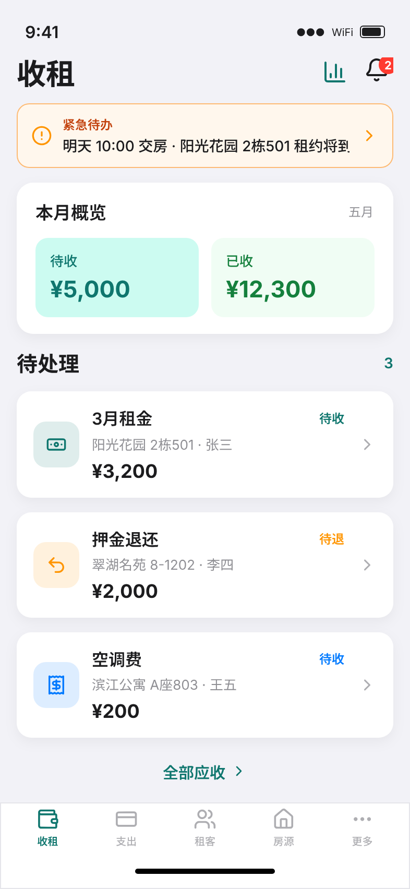 | 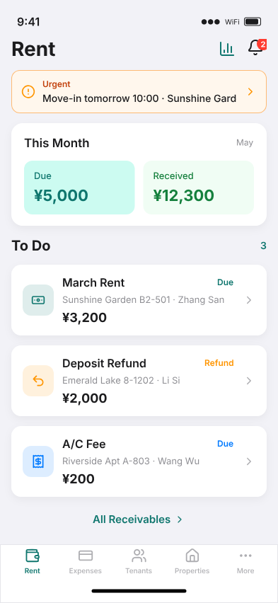 |

> 源文件：`pencil/rentimate-rent.pen` · 画板 `r-01-rent-home-zh` / `r-01-rent-home-en`

#### R-01 收租总览 — 界面要素（以设计稿为准）

| 区域 | 中文 | 英文 |
|------|------|------|
| 导航栏 | 左大号标题「收租」；右 **chart-column**（财务统计）、**bell** + 红角标 `2` | 左 **Rent**；右 **Stats**、**Alerts** + badge `2` |
| 紧急横幅 | 橙底 `#FFF7ED`：**紧急待办** + `明天 10:00 交房 · 阳光花园 2栋501 租约将到期` + `›` | **Urgent** + `Move-in tomorrow 10:00 · Sunshine Garden B2-501 lease expiring` |
| 本月概览 | 白卡片：**本月概览** + 右上 **五月**；并排 **待收** `¥5,000`（青底 `#CCFBF1`）、**已收** `¥12,300`（绿底 `#F0FDF4`） | **This Month** + **May**；**Due** / **Received** 同金额示例 |
| 待处理列表 | **待处理** + 角标 `3`；卡片行：圆角图标底 + 标题 + 状态标签 + 副标题 + 金额 + `›` | **To Do** + `3`；同上结构 |
| 列表示例 1 | **3月租金** · **待收** · 阳光花园 2栋501 · 张三 · `¥3,200` · banknote 图标 | **March Rent** · **Due** · Sunshine Garden B2-501 · Zhang San · `¥3,200` |
| 列表示例 2 | **押金退还** · **待退** · 翠湖名苑 8-1202 · 李四 · `¥2,000` · undo-2 图标 | **Deposit Refund** · **Refund** · Emerald Lake 8-1202 · Li Si · `¥2,000` |
| 列表示例 3 | **空调费** · **待收** · 滨江公寓 A座803 · 王五 · `¥200` · receipt 图标 | **A/C Fee** · **Due** · Riverside Apt A-803 · Wang Wu · `¥200` |
| 状态标签色 | 待收 `#0F766E`、待退 `#FF9500`、附加费待收 `#007AFF` | **Due** (teal)、**Refund** (orange)、fee **Due** (blue) |
| 列表底链 | 居中 teal 链：**全部应收** + chevron | **All Receivables** + chevron |
| 底部 Tab | wallet **收租**（选中青）、credit-card 支出、users 租客、house 房源、ellipsis 更多 + Home Indicator | 同上英文标签；选中项 icon/label 均为 `#0F766E` |

**R-02 应收详情**（从 R-01 待处理卡片进入；Pencil 画板名 `r-02-receivable-detail-*`）

| 中文 | 英文 |
|------|------|
| 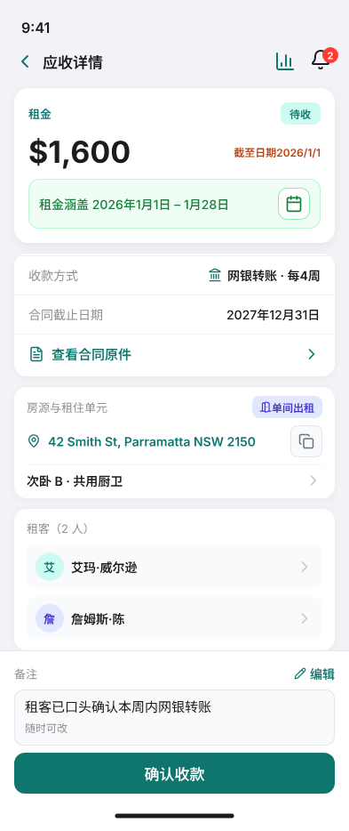 | 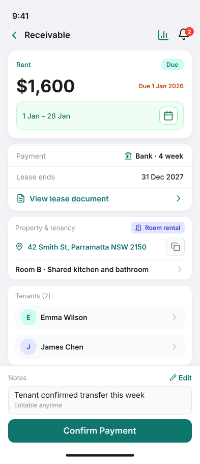 |

> 画板 `r-02-receivable-detail-zh` / `r-02-receivable-detail-en` · 页面编号 **R-02**

#### R-02 应收详情 — 界面要素（以设计稿为准）

| 区块 | 中文 | 英文 |
|------|------|------|
| 导航栏 | 左 **chevron-left**（无「返回」文字）；中 **应收详情**；右 chart-column、bell+角标 | 左 chevron；中 **Receivable**；右 Stats、Alerts |
| 金额卡 | 首行 **租金** + 青底 pill **待收**；次行左 **`$1,600`**、右橙字 **`截至日期2026/1/1`** | **Rent** + **Due** pill；**`$1,600`** + **`Due 1 Jan 2026`** |
| 涵盖条 | 绿底 `#F0FDF4` 条：**租金涵盖 2026年1月1日 – 1月28日** + 右日历方钮 | 绿条：**`1 Jan – 28 Jan`** + calendar button |
| 合同卡 | 独立白卡片三行：**收款方式**｜网银转账·每4周；**合同截止日期**｜2027年12月31日；**查看合同原件** `›` | **Payment**｜Bank · 4 week；**Lease ends**｜31 Dec 2027；**View lease document** |
| 房源卡 | **房源与租住单元** + 靛蓝 **单间出租**；teal 地址 + map-pin + **复制** 方钮；**次卧 B · 共用厨卫** `›` | **Property & tenancy** + **Room rental**；address + copy；**Room B · Shared kitchen and bathroom** |
| 租客卡 | **租客（2 人）**；灰底行：头像首字 **艾**/**詹** + **艾玛·威尔逊** / **詹姆斯·陈** + `›` | **Tenants (2)**；**E**/**J** + **Emma Wilson** / **James Chen** |
| 底栏 Dock | **备注** + pencil **编辑**；灰框正文「租客已口头确认本周内网银转账」+ **随时可改**；其下三按钮（见下行） | **Notes** + **Edit**；`Tenant confirmed transfer this week` + **Editable anytime** |
| 底栏按钮 | **确认全额收款**（青底白字）→ **确认部分收款**（描边）→ R-04b → **延期收租**（描边）→ R-04c | **Confirm full payment** → **Confirm partial payment** → **Postpone collection** |

**R-04b 部分收款**（R-02 底栏「确认部分收款」进入；Pencil 画板名 `r-04-partial-payment-*`）

| 中文 | 英文 |
|------|------|
| 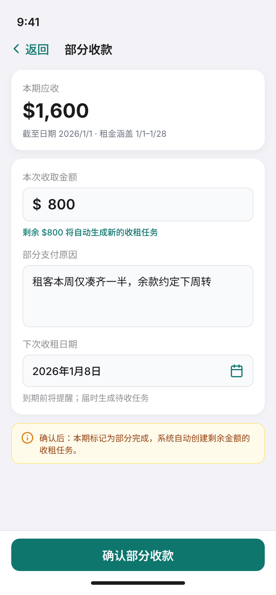 | 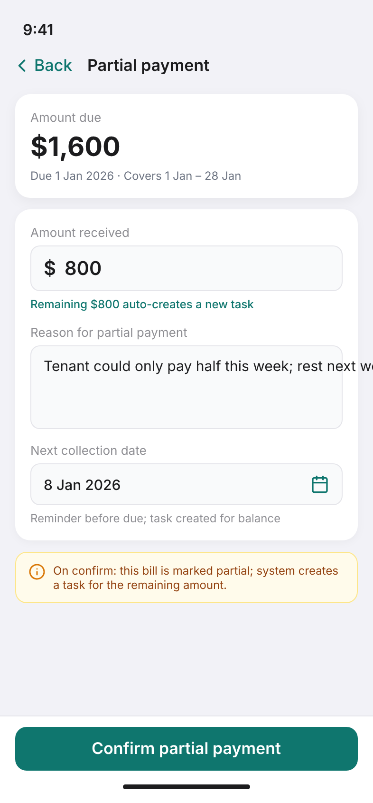 |

> 画板 `r-04-partial-payment-zh` / `r-04-partial-payment-en` · 页面编号 **R-04b** · 业务规则 §4.11

#### R-04b 部分收款 — 界面要素（以设计稿为准）

| 区块 | 中文 | 英文 |
|------|------|------|
| 导航 | **返回** + chevron + 标题「部分收款」 | **Back** + **Partial payment** |
| 摘要卡 | **本期应收** **`$1,600`**；灰字 **`截至日期 2026/1/1 · 租金涵盖 1/1–1/28`** | **Amount due** **`$1,600`**；**`Due 1 Jan 2026 · Covers 1 Jan – 28 Jan`** |
| 本次收取金额 | 输入 `$` **`800`**；青字提示 **剩余 $800 将自动生成新的收租任务** | **Amount received** `$` **`800`**；**Remaining $800 auto-creates a new task** |
| 部分支付原因 | 多行；示例「租客本周仅凑齐一半，余款约定下周转」 | 示例 `Tenant could only pay half this week; rest next week` |
| 下次收租日期 | **`2026年1月8日`** + calendar；灰字 **到期前将提醒；届时生成待收任务** | **`8 Jan 2026`**；**Reminder before due; task created for balance** |
| 说明条 | 黄底 info：**确认后：本期标记为部分完成，系统自动创建剩余金额的收租任务。** | **On confirm: this bill is marked partial; system creates a task for the remaining amount.** |
| 提交 | 底栏青钮 **确认部分收款** | **Confirm partial payment** |

**R-04c 延期收租**（R-02 底栏「延期收租」进入；Pencil 画板名 `r-04c-postpone-collection-*`）

| 中文 | 英文 |
|------|------|
| 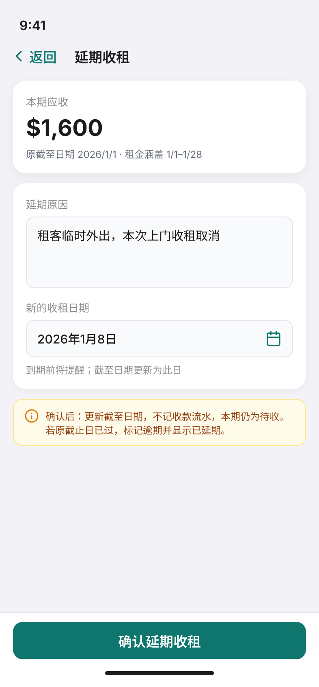 | 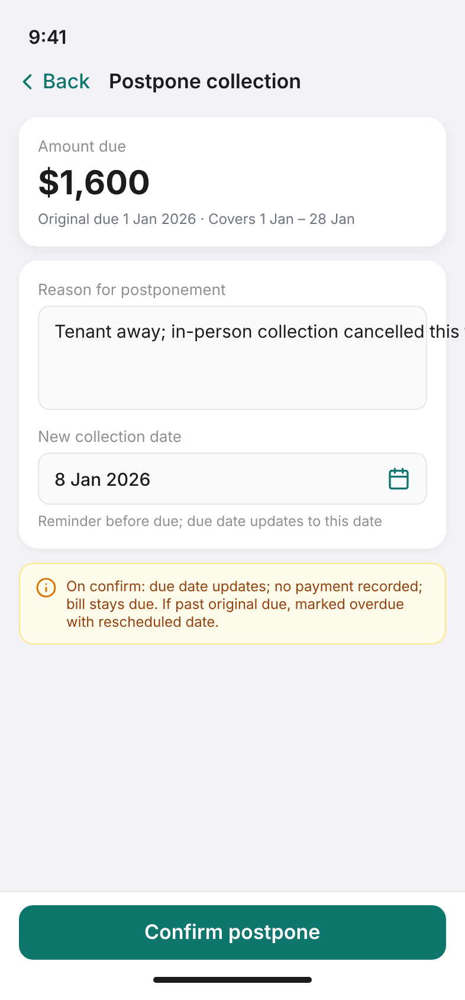 |

> 画板 `r-04c-postpone-collection-zh` / `r-04c-postpone-collection-en` · 页面编号 **R-04c** · 业务规则 §4.12

#### R-04c 延期收租 — 界面要素（以设计稿为准）

| 区块 | 中文 | 英文 |
|------|------|------|
| 导航 | **返回** + chevron + 标题「延期收租」 | **Back** + **Postpone collection** |
| 摘要卡 | **本期应收** **`$1,600`**；灰字 **`原截至日期 2026/1/1 · 租金涵盖 1/1–1/28`** | **Amount due** **`$1,600`**；**`Original due 1 Jan 2026 · Covers 1 Jan – 28 Jan`** |
| 延期原因 | 多行；示例「租客临时外出，本次上门收租取消」 | 示例 `Tenant away; in-person collection cancelled this time` |
| 新的收租日期 | **`2026年1月8日`** + calendar；灰字 **到期前将提醒；截至日期更新为此日** | **`8 Jan 2026`**；**Reminder before due; due date updates to this date** |
| 说明条 | 黄底 info：**确认后：更新截至日期，不记收款流水，本期仍为待收。若原截止日已过，标记逾期并显示已延期。** | **On confirm: due date updates; no payment recorded; bill stays due. If past original due, marked overdue with rescheduled date.** |
| 提交 | 底栏青钮 **确认延期收租** | **Confirm postpone** |

**租金涵盖日期**（R-02 金额卡日历按钮 → 全屏子页）

| 中文 | 英文 |
|------|------|
| 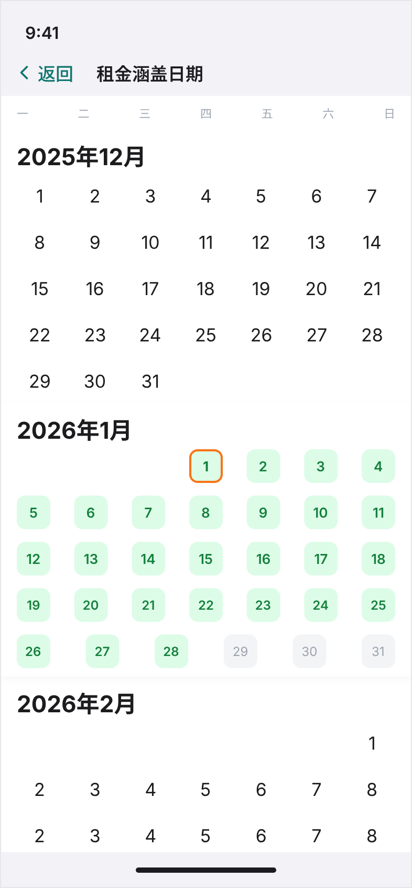 | 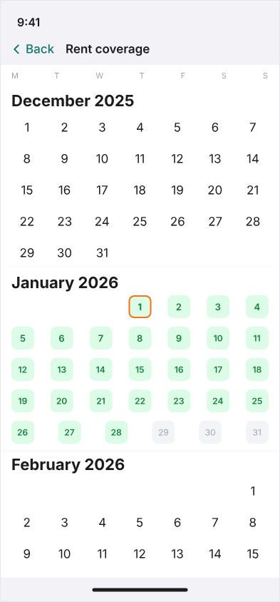 |

> 画板 `r-03-coverage-calendar-zh` / `r-03-coverage-calendar-en` · 393×844 全屏

#### R-03 租金涵盖日期 — 界面要素（以设计稿为准；Pencil 画板名 `r-03-coverage-calendar-*`）

| 要素 | 说明 |
|------|------|
| 导航 | **返回** + chevron + 标题「租金涵盖日期」/ **Rent coverage**（与 R-04b 同模式） |
| 页面底色 | 月历区白底 `#FFFFFF`；周标题条固定于顶部 |
| 周标题 | **一～日** / **M～S**（中文从周一开始） |
| 月列表 | **连续滚动**三个月：**2025年12月** → **2026年1月** → **2026年2月**；无切月箭头 |
| 涵盖高亮 | 仅 **2026年1月** 的 **1–28 日**：浅绿底 `#DCFCE7`、绿字 `#15803D` |
| 截止日标记 | **1 月 1 日** 额外 **橙色描边** `#F97316`（账期首日 = 应付截止日） |
| 同月非涵盖 | 1 月 **29–31 日** 灰底 `#F3F4F6`（仍在当月但不在本期涵盖内） |
| 其他月份 | 2025 年 12 月、2026 年 2 月等为默认黑字样式，无涵盖高亮 |

| 编号 | 页面 | 说明 | 设计稿 |
|------|------|------|--------|
| R-01 | 收租总览 | 见上文 **R-01 界面要素**；默认落地 Tab；底链 **全部应收** 进入列表（**列表页设计待补**） | [中文](images/rent/r-01-rent-home-zh.png) · [英文](images/rent/r-01-rent-home-en.png) |
| R-02 | 应收详情 | 见上文 **R-02 界面要素** + §4.10；底栏 **确认全额收款** / **确认部分收款**（→ R-04b）/ **延期收租**（→ R-04c） | [详情 中文](images/rent/r-02-receivable-detail-zh.png) · [详情 英文](images/rent/r-02-receivable-detail-en.png) · [月历 中文](images/rent/r-03-coverage-calendar-zh.png) · [月历 英文](images/rent/r-03-coverage-calendar-en.png) |
| R-03 | 租金涵盖日期 | R-02 日历按钮进入的全屏月历；见 **R-03 租金涵盖日期 — 界面要素** | 同上「月历」列 |
| R-04 | 确认全额收款 | R-02 **确认全额收款**：默认全额到账、一键确认（Sheet 设计稿待补）；见 §4.11 | — |
| R-04b | 部分收款 | 输入本次金额、部分支付原因、下次收租日期；确认后原单 `partial` 并**自动创建**剩余收租任务；见 §4.11 | [中文](images/rent/r-04-partial-payment-zh.png) · [英文](images/rent/r-04-partial-payment-en.png) |
| R-04c | 延期收租 | 输入延期原因、新的收租日期；零到账改期，更新本单截至日；见 §4.12 | [中文](images/rent/r-04c-postpone-collection-zh.png) · [英文](images/rent/r-04c-postpone-collection-en.png) |
| R-05 | 新增应收 Sheet | 附加收费、赔偿等（非自动生成的租金） |
| R-06 | 确认押金 Sheet | 押金收取 / 退还；全部收取或全部退还时默认填满剩余金额；**部分收取、部分退还须房东手动输入金额** |

### 5.2 支出 Tab

> 源文件：`pencil/rentimate-expenses.pen`（iPhone 宽 393px，画板高 852）  
> **设计定位**：支出 Tab 是**记录账本**，方便房东登记、查阅房产相关花费，支撑报税留痕；**不是**收租式的待办 / 待付催办流程。

**设计稿插图一览**（`images/expenses/`）

| 页面 | 中文 | 英文 |
|------|------|------|
| E-01 支出总览 | [e-01-expense-home-zh.png](images/expenses/e-01-expense-home-zh.png) | [e-01-expense-home-en.png](images/expenses/e-01-expense-home-en.png) |
| E-02 支出历史 | [e-02-expense-history-zh.png](images/expenses/e-02-expense-history-zh.png) | [e-02-expense-history-en.png](images/expenses/e-02-expense-history-en.png) |
| E-03 创建记录 · 默认 | [e-03-add-expense-zh.png](images/expenses/e-03-add-expense-zh.png) | [e-03-add-expense-en.png](images/expenses/e-03-add-expense-en.png) |
| E-03 · 展开分类 | [e-03-add-expense-zh-more.png](images/expenses/e-03-add-expense-zh-more.png) | [e-03-add-expense-en-more.png](images/expenses/e-03-add-expense-en-more.png) |
| E-03 · 新建分类 | [e-03-add-expense-zh-new-category.png](images/expenses/e-03-add-expense-zh-new-category.png) | [e-03-add-expense-en-new-category.png](images/expenses/e-03-add-expense-en-new-category.png) |

| 编号 | 页面 | 说明 |
|------|------|------|
| E-01 | 支出总览 | 本月 / 上月对比简卡、**+ 创建记录**入口、最近记录列表 |
| E-02 | 支出历史 | 近 12 个月柱状图；选中月分类饼图 + 每日记录列表 |
| E-03 | 创建记录 | 分类 chip、金额、房源、发生日期、备注、凭证（最多 5 张） |
| E-04 | 支出记录列表 | 全部已记支出；按房源 / 分类 / 时间筛选 |
| E-05 | 支出详情 | 记录明细、关联房源、凭证 / 收据 |
| E-06 | 编辑支出 Sheet | 修改分类、金额、日期、备注与凭证 |

#### E-01 支出总览

> 画板 `e-01-expense-home-zh` / `e-01-expense-home-en`

```text
┌──────────────────────────────┐
│  支出                📊  🔔(2) │
├──────────────────────────────┤
│  [!] 紧急待办（有则展示）        │
├──────────────────────────────┤
│  📅✓ 本月已支出  📅 上月支出      │
│  $3,400         $2,680         │
│  [📊 查看支出历史 · 近12个月柱状图  ›] │
├──────────────────────────────┤
│  登记支出                      │
│  登记后出现在下方「最近记录」    │
│  [  + 创建记录  ]             │  → E-03
├──────────────────────────────┤
│  最近记录                      │
│  🔧 5/18·维修 01          $320 › │
│  🏢 5/10·保险             $880 › │
│  🔧 5/3·维修              $145 › │
└──────────────────────────────┘
```

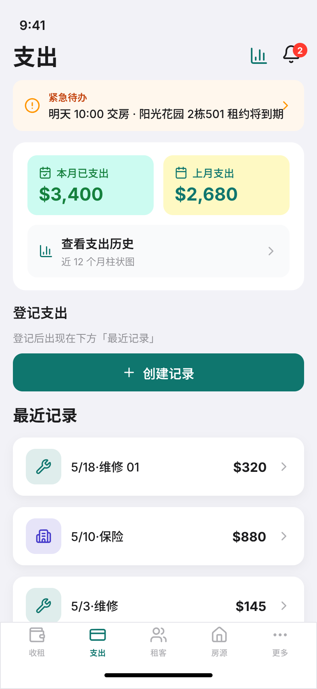

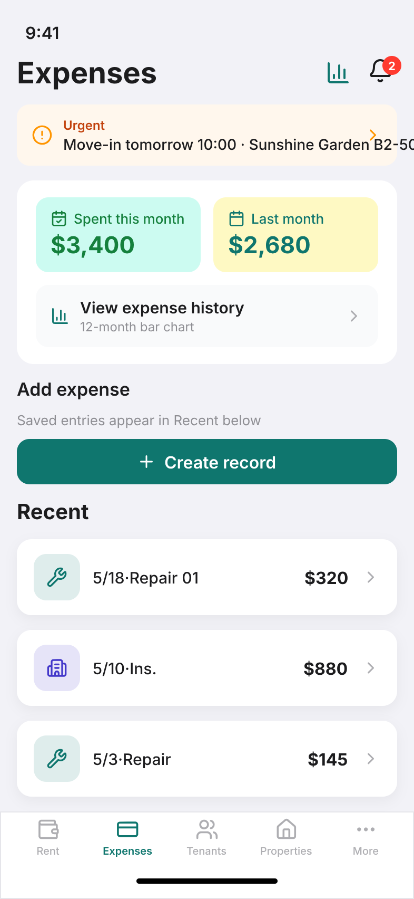

**E-01 界面要素**

| 区域 | 中文 | 英文 | 说明 |
|------|------|------|------|
| 大标题 | 支出 | Expenses | 28pt Bold |
| 导航栏 | 📊 财务统计 + 🔔 消息 | 同上 | 与 R-01 一致 |
| 紧急横幅 | **紧急待办** + 交房 / 到期文案 | **Urgent** + 同上 EN | 跨 Tab 全局横幅 |
| 月份对比卡 | 并排双卡 + 支出历史入口 | 同上 | 不设「本月概览」区块标题 |
| 对比 · 左卡 | 📅✓ **本月已支出** `$3,400` | 📅✓ **Spent this month** | 底 `#CCFBF1`、字 `#15803D` |
| 对比 · 右卡 | 📅 **上月支出** `$2,680` | 📅 **Last month** | 底 `#FEF9C3`、字 `#0F766E` |
| 支出历史 | **查看支出历史** + 近 12 个月柱状图 + › | **View expense history** + 12-month bar chart + › | → **E-02** |
| 登记区块标题 | **登记支出** | **Add expense** | 15pt 区块标题 |
| 登记说明 | 登记后出现在下方「最近记录」 | Saved entries appear in Recent below. | 13pt 灰色说明 |
| 主按钮 | **+ 创建记录** | **+ Create record** | 全宽青底 → **E-03** |
| 最近记录 | **最近记录** | **Recent** | 按登记时间倒序 |
| 记录卡片 | 分类图标 + **记录编号** + 金额 + › | 同上 | 单行主信息；如 `5/18·维修 01`、`5/10·保险` |
| 底部 Tab | credit-card **支出**（选中青） | Expenses | 同 R-01 Tab 样式 |

#### E-02 支出历史

> 画板 `e-02-expense-history-zh` / `e-02-expense-history-en` · 由 E-01 **查看支出历史** 进入

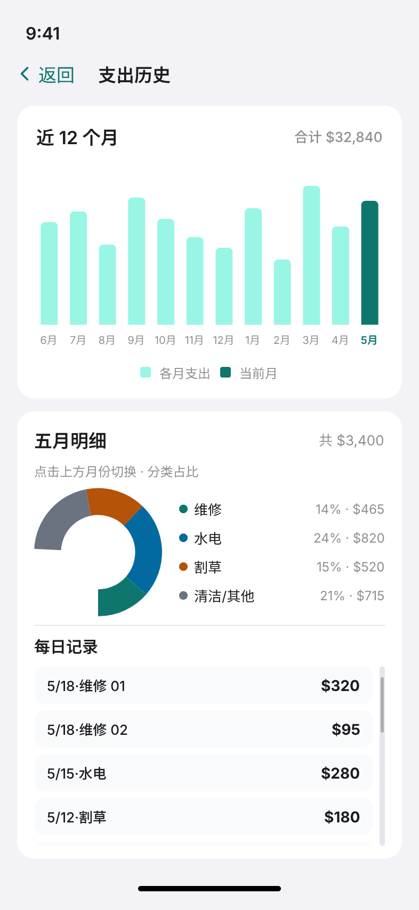

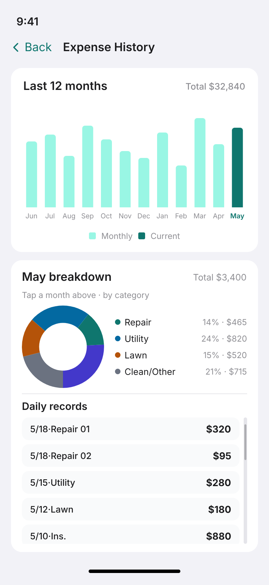

**E-02 界面要素**

| 区域 | 中文 | 英文 | 说明 |
|------|------|------|------|
| 导航栏 | ‹ **返回** + **支出历史** | ‹ **Back** + **Expense History** | 子页；无底部 Tab |
| 图表卡标题 | **近 12 个月** | **Last 12 months** | 左标题 17pt |
| 合计 | 合计 **$32,840** | Total **$32,840** | 右上灰色摘要 |
| 柱状图 | 6月～5月 共 12 柱 | Jun～May | 历史月 `#99F6E4`、当前月 **5 月** `#0F766E` |
| 图例 | 各月支出 · 当前月 | Monthly · Current | 柱状图下方居中 |
| 月份明细卡 | **五月明细** + 共 **$3,400** | **May breakdown** + Total **$3,400** | 点击上方柱切换月份 |
| 明细提示 | 点击上方月份切换 · 分类占比 | Tap a month above · by category | 12pt 灰色 |
| 分类饼图 | 左 donut + 右图例 | 同上 | 图例：**维修** 14%·$465、**水电** 24%·$820、**割草** 15%·$520、**清洁/其他** 21%·$715 |
| 每日记录 | **每日记录** | **Daily records** | 可滚动列表 |
| 每日行 | **记录编号** + 金额 | 同上 | 如 `5/18·维修 01`·$320、`5/10·保险`·$880；多笔同日同分类用 `01` `02` |

#### E-03 创建记录

> 画板见上表 · 由 E-01 **+ 创建记录** 进入

**内置分类（MVP）**：维修、水电、清洁、割草、除虫、保险、其他（共 7 类）；首屏展示常用四类 + **更多**，展开后见全部；**不含**物业、税费。

```text
┌──────────────────────────────┐
│  取消        创建记录           │
├──────────────────────────────┤
│  分类                          │
│  [维修*][水电][清洁][割草][更多▾]│  ← 默认（* = 选中）
│  [维修][水电][清洁][割草]        │  ← 点「更多」后
│  [除虫][保险][其他][ + ]         │     「更多」消失
│  金额    $ 0.00                │
│  房源    选择房源            ›   │
│  发生日期 2026年5月29日    📅   │
│  备注（可选）                   │
│  凭证 / 收据（可选）  📷 拍照…   │
│  最多上传 5 张                   │
├──────────────────────────────┤
│  [ 保存 ]                      │
└──────────────────────────────┘
```

**E-03 交互状态**

| 画板 | 说明 |
|------|------|
| `e-03-add-expense-zh` / `en` | 默认：首行四类 + **更多 ▾**；默认选中 **维修** / **Repair** |
| `e-03-add-expense-zh-more` / `en-more` | 点 **更多** 后：两行 chip 展示全部分类，**更多** 消失；末位 **+** |
| `e-03-add-expense-zh-new-category` / `en-new-category` | 点 **+** 后：半透明蒙层 + **新建分类** 对话框 |

**E-03 · 中文**

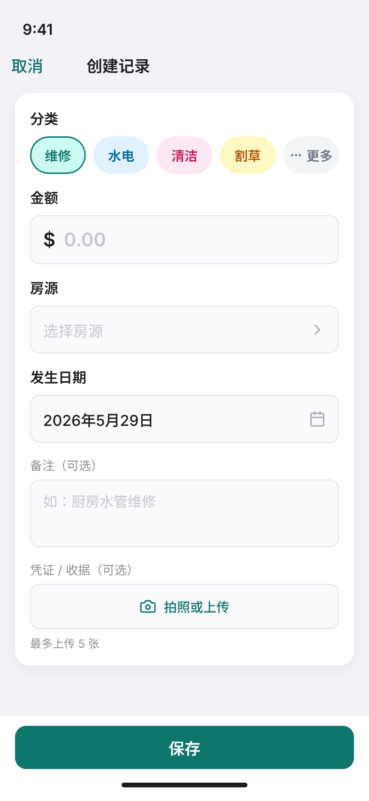

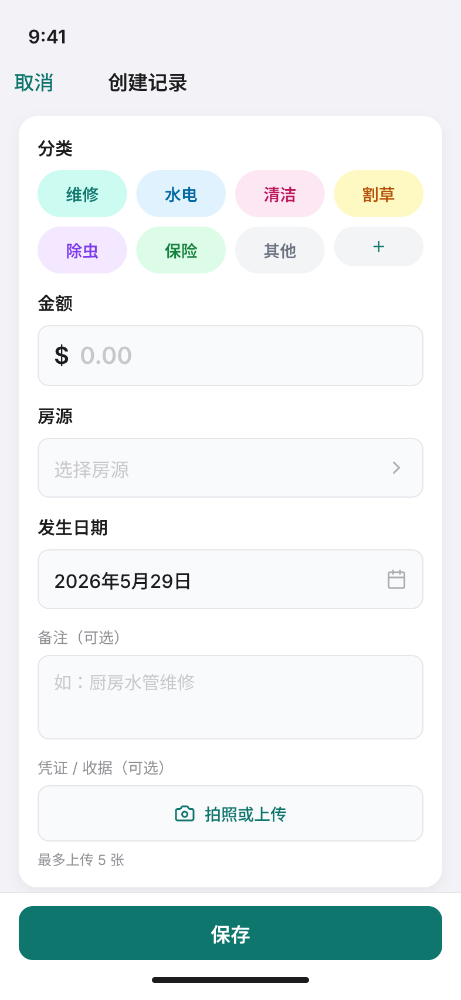

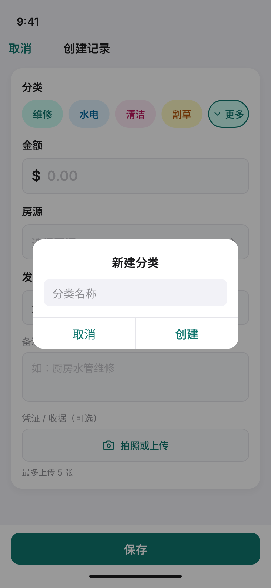

**E-03 · English**

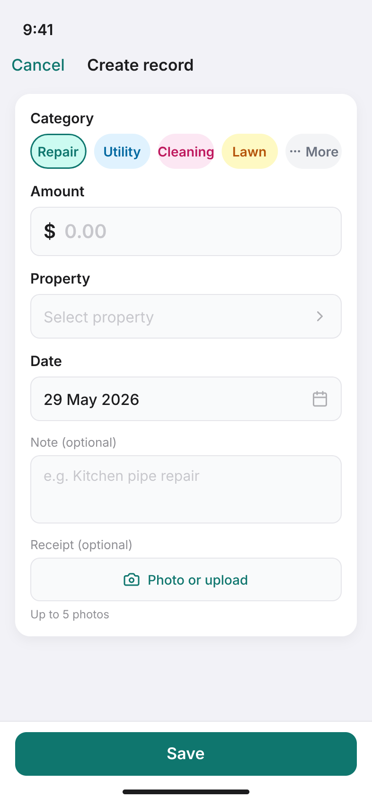

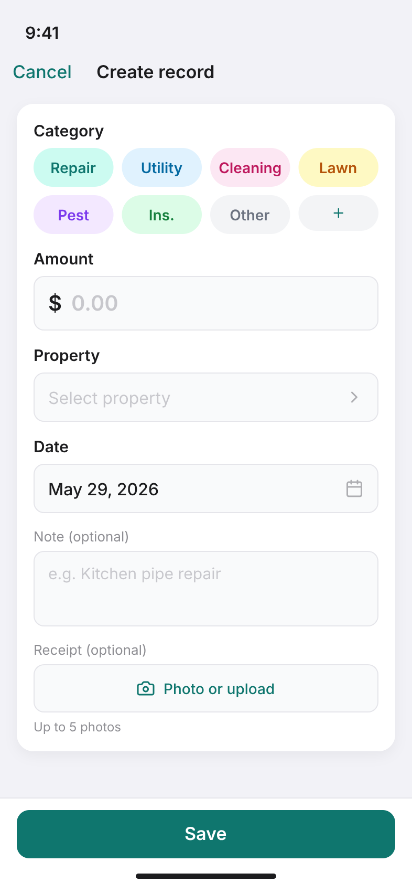

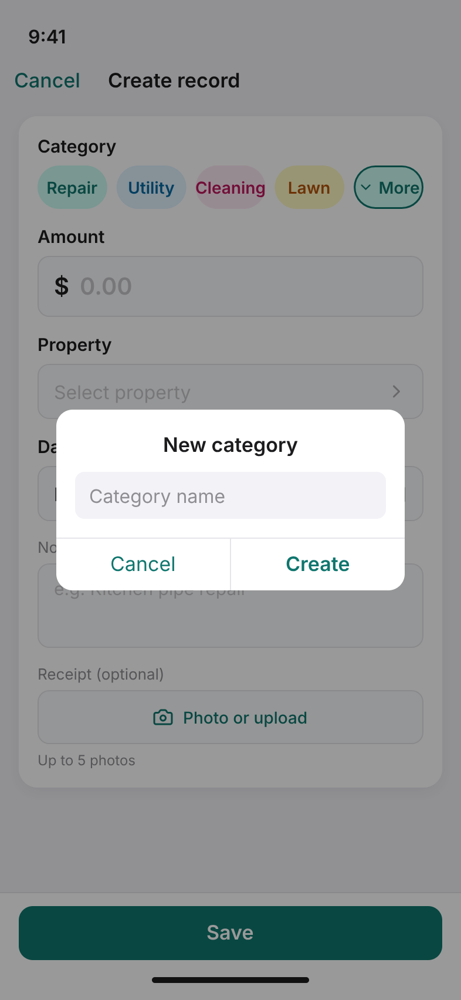

**E-03 界面要素**

| 区域 | 中文 | 英文 | 说明 |
|------|------|------|------|
| 导航栏 | **取消** + **创建记录** | Cancel + **Create record** | 模态表单；无底部 Tab |
| 分类 · 默认 | 维修、水电、清洁、割草 + **更多 ▾** | Repair、Utility、Cleaning、Lawn + **More ▾** | 首行 5 chip；默认选中首项（青描边） |
| 分类 · 展开 | 两行：除虫、保险、其他 + **+** | Pest、Ins.、Other + **+** | 与首行同尺寸 chip；**更多** 不再显示 |
| 新建分类 | **新建分类** · 分类名称 · 取消 / **创建** | **New category** · Category name · Cancel / **Create** | 居中 Alert；半透明蒙层 |
| 金额 | `$` + `0.00` | 同上 | 标签 15pt；输入区浅灰底 |
| 房源 | **选择房源** + › | **Select property** + › | 标签 **房源** / **Property** |
| 发生日期 | **2026年5月29日** + 📅 | **29 May 2026** + 📅 | 标签 **发生日期** / **Date** |
| 备注 | **备注（可选）** | **Note (optional)** | 占位如「厨房水管维修」 |
| 凭证 | **拍照或上传** | **Photo or upload** | 标签 **凭证 / 收据（可选）** |
| 上传上限 | **最多上传 5 张** | **Up to 5 photos** | 按钮下方 12pt `#8E8E93` |
| 底栏 | **保存** | **Save** | 写入后返回 E-01，刷新最近记录与本月已支出 |

### 5.3 租客 Tab

| 编号 | 页面 | 说明 |
|------|------|------|
| T-01 | 租客列表 | 按在租 / 已退租、欠款状态筛选 |
| T-02 | 租客详情 | 基本信息、当前 / 历史租约、收租与押金摘要 |
| T-03 | 添加 / 编辑租客 | 表单录入 |
| T-04 | 提醒记录 | 催缴与收款确认消息日志 |
| T-05 | 租约详情 | 条款摘要、跳转合同库 / 交接 / 收租单据 |

### 5.4 房源 Tab

| 编号 | 页面 | 说明 |
|------|------|------|
| P-01 | 房源列表 | 按空置 / 在租筛选；**不**展示本月待收金额角标 |
| P-02 | 房源详情 | 基本信息、当前租约与租客、**本月待收 / 本月支出**及收支简卡 |
| P-03 | 添加 / 编辑房源 | 地址、户型、面积等 |
| P-04 | 创建 / 编辑租约 | 关联租客、租金、押金、付租周期、自动生成应收开关 |

### 5.5 更多 Tab

| 编号 | 页面 | 说明 |
|------|------|------|
| M-01 | 更多菜单 | 点击底部「更多」后的竖向菜单页；4 个菜单项纵向排列，点选进入对应功能 |
| M-02 | 合同库 | 由 M-01 点「合同库」进入；全部合同与附件；按房源 / 租客 / 时间筛选 |
| M-03 | 合同详情 | 由 M-02 进入；预览、下载、关联租约 |
| M-04 | 交接任务列表 | 由 M-01 点「交接任务」进入；待交房、待收房、已完成 |
| M-05 | 设置 | 由 M-01 点「设置」进入；账号、通知偏好、关于 |

**交接子流程（从 M-04 或租约详情进入）**

| 编号 | 页面 | 说明 |
|------|------|------|
| H-01 | 交接详情 | 阶段、清单、照片、备注；入口上传合同 |
| H-02 | 交房清单 | 基于预置模板（家电、家具、墙面、钥匙等）逐项确认；水电读数、现场情况 |
| H-03 | 收房验房清单 | 基于预置模板核对；损耗项、维修项、扣费建议 |

### 5.6 财务统计（分析层，非底部 Tab）

由 **导航栏 📊** 或 **更多 → 财务统计** 进入；5 个主 Tab 均可一键打开。

```text
┌──────────────────────────────┐
│  财务总览            ‹  关闭   │  （或导航返回）
├──────────────────────────────┤
│  [ 按月 | 租约账期 ]           │  ← 口径切换（F-01～F-04 同步）
│  ◀ 2026年3月 ▶                │  （按月：选年月；账期：选租约+期次）
├──────────────────────────────┤
│  收入 ¥12,300  支出 ¥3,400    │
│  净额 ¥8,900                  │
├──────────────────────────────┤
│  趋势 · 房源 · 分类  ›         │
└──────────────────────────────┘
```

| 编号 | 页面 | 说明 |
|------|------|------|
| F-01 | 财务总览 | 顶部切换按月/租约账期；收入、支出、净额；入口至 F-02～F-04 |
| F-02 | 趋势分析 | 按月：按月/年趋势；租约账期：按租约多期对比（MVP 可简版） |
| F-03 | 房源分析 | 当前口径下各房源收入、支出、净收益排序 |
| F-04 | 分类统计 | 当前口径下收入/支出分类占比 |

---

## 6. 核心用户流程

### 6.1 登录与默认落地

1. 用户打开 App 或登录后，进入 **收租** Tab（R-01）。
2. 导航栏始终展示 **📊 财务统计**、**🔔 消息 / 提醒**。
3. 若有紧急跨模块待办，在**当前所在主 Tab** 顶部横幅展示（5 个 Tab 均如此），点击跳转（交接任务、租约、待收单等）。
4. 非紧急消息进入 G-01，由 🔔 查看。

### 6.2 每月高频流程（收租闭环）

**全额收款**

1. 系统按租约自动生成本期租金应收。
2. 到期前通过提醒策略通知房东。
3. 房东在 **收租** 待处理列表点进 **应收详情**（R-02），可查看截至日期、租金涵盖区间；点 **日历按钮** 进入 **租金涵盖日期**（R-03）全屏月历核对涵盖日。
4. 租客**全额**到账后，在 R-02 底栏点击 **确认全额收款**（R-04，默认本期全额）。
5. 系统按品牌邮件模板发送租客收款确认邮件。
6. **财务统计**（F-01）自动更新；收租首页简卡同步刷新。

**部分收款**（见 §4.11）

1. 房东在 R-02 点击 **确认部分收款**，进入 **R-04b**。
2. 填写 **本次收取金额**、**部分支付原因**、**下次收租日期**。
3. 点击 **确认部分收款**：原单标记 `partial` 并记本次流水；系统**自动创建**剩余金额的新应收任务（截至日 = 下次收租日期）。
4. 新任务出现在 R-01 待处理列表；到期前提醒；后续可再次全额或部分确认直至结清。

**延期收租**（见 §4.12）

1. 截止日未收到任何款项（如租客临时外出、本次上门取消），房东在 R-02 点击 **延期收租**，进入 **R-04c**。
2. 填写 **延期原因**、**新的收租日期**。
3. 点击 **确认延期收租**：不记收款流水；本单 **截至日期** 更新为新日期；状态仍为 `pending`（若已过原截止日则 `overdue` 并展示已延期）。
4. R-01 待处理列表继续展示该笔；按新截至日提醒；后续可全额 / 部分收款或再次延期。

### 6.3 支出记录流程

1. 房东在 **支出** Tab 点 **+ 创建记录** → 进入 **E-03**，选分类（首行常用或 **更多** 展开）并填写金额、房源、发生日期、备注；凭证 / 收据可选，**最多 5 张**。
2. 若无合适分类，点 **更多** 展开全部内置分类；或点 **+** → 对话框输入名称 → **创建**；新分类出现在 chip 区并自动选中。
3. 保存时系统按 **发生日期 + 分类 + 登记顺序** 生成 **记录编号**（displayRef），并即时出现在 E-01 **最近记录** 与 E-04 **全部记录**；本月已支出简卡自动刷新。
4. 点击 **查看支出历史** 进入 **E-02** 查看近 12 个月柱状图。
5. **财务统计**（F-01）与 F-04 分类占比同步更新，供月底经营分析与**报税前汇总**查阅。
6. 需修改时在 E-05 详情进入 E-06 编辑；删除或作废规则见 §4.5（MVP 可简化为允许编辑并记录更新时间）。

### 6.4 押金闭环流程

1. 签约后在 **收租** 发起「押金收取」（R-06）：一次收齐则确认默认全额；分次收取则选择部分收取并**手动输入**本次金额。
2. 退租时在 **收租** 发起「押金退还」（R-06）：应退清则确认默认全额；分次退还则**手动输入**本次退还金额；扣款关联 H-03 验房结果后，应退余额相应减少。
3. 系统按流水汇总更新押金展示状态（§4.2）；财务统计单独口径展示押金变动，不与租金收入混淆。

### 6.5 房源与租约流程

1. 在 **房源** Tab 新增房源（P-03）。
2. 在房源详情创建租约并关联租客（P-04）；可选开启自动生成应收。
3. 房源状态变为在租；**收租** 开始出现周期账单。
4. 租约结束或退租后，房源回到空置；历史数据保留可查。

### 6.6 合同流程

1. 签约后从租约详情或 **更多 → 合同库** 上传合同（M-02 / M-03）。
2. 续约追加新版本或新文档，仍关联同一租约。
3. 需要时从合同库按房源 / 租客检索。

### 6.7 交接流程

1. 在 **更多 → 交接任务** 或租约详情创建交房 / 收房任务（M-04 → H-01）。
2. 交房：按预置模板填写 H-02 清单并上传现场照片。
3. 收房：按预置模板完成 H-03 验房；产生扣费建议。
4. 一键生成 **收租** 赔偿应收或调整押金退还；**财务统计** 自动更新。

### 6.8 通过「更多」竖向菜单进入功能

1. 用户点击底部 **更多**，进入 M-01 竖向菜单页。
2. 在菜单中点选 **合同库 / 交接任务 / 财务统计 / 设置** 之一，直接进入对应页面。
3. 无需经过分组页或二级目录。

### 6.9 随时查看经营结果

1. 用户在任意主 Tab 点击导航栏 **📊**，或在 M-01 菜单中点 **财务统计**。
2. 进入 F-01；选择 **按月** 或 **租约账期** 查看对应汇总。
3. 下钻 F-02～F-04 时保持当前所选口径。
4. Tab 首页「本月概览」按当前日历月汇总，卡片上显示当前月份名（如「五月」）。

---

## 7. 数据模型（MVP）

```text
User
  id, name, phone, email, createdAt

Property
  id, userId, name, address, layout, area, status(vacant|occupied),
  createdAt, updatedAt

Tenant
  id, userId, name, phone, email, idNumber?, emergencyContact?, note

Lease
  id, propertyId, tenantId, startDate, endDate?, monthlyRent, deposit,
  payCycle, dueDay, autoGenerateReceivable, status(active|ended|cancelled),
  depositDisplayStatus(collected_full|collected_partial|refunded_full|refunded_partial)?
  // depositDisplayStatus 由 deposit_in / deposit_out 流水汇总计算，非手填

BillingPeriod
  id, leaseId, propertyId, startDate, endDate, label?, sequence?
  // 租约账期；自动生成租金应收时创建并关联

ExpenseCategory
  id, userId, name, isBuiltIn, sortOrder?, color?, createdAt
  // isBuiltIn=true：维修/水电/清洁/割草/除虫/保险/其他 等预置；false：用户对话框「新建分类」创建
  // 自定义分类仅归属 userId；名称同账号内唯一

Transaction
  id, type(receivable|payable),
  category(rent|deposit_in|deposit_out|fee|compensation|repair|utility|tax|other),
  expenseCategoryId?, categoryLabel?,
  leaseId?, propertyId?, tenantId?, billingPeriodId?, amount,
  dueDate?, confirmedAt?, status, note, attachmentUrls?, createdAt,
  displayRef?, displayRefSeq?,
  parentTransactionId?, partialReason?, nextCollectionDate?,
  postponeReason?, rescheduledFromDueDate?
  // displayRef：支出可读编号，如「5/18·维修 01」或单笔「5/15·水电」；按发生日+分类+createdAt 生成
  // displayRefSeq：同组（发生日+分类）内序号，从 1 起；删除不回收
  // expenseCategoryId / categoryLabel：支出类 payable 关联 ExpenseCategory；displayRef 用 categoryLabel
  // parentTransactionId：R-04b 部分收款后，剩余任务指向原应收
  // partialReason / nextCollectionDate：R-04b 部分收款表单字段（展示与审计）
  // postponeReason / rescheduledFromDueDate：R-04c 延期收租表单字段（展示与审计；dueDate 更新为新收租日）
  // 自然月汇总：按 confirmedAt 的 YYYY-MM；租约账期汇总：租金/押金类用 billingPeriodId

EmailTemplate
  id, triggerType(payment_confirmation|...), subjectTemplate, bodyTemplate,
  senderEmail, senderName, replyTo?
  // MVP 内置产品设计稿；后续可扩展多语言/多模板

MessageLog
  id, tenantId, templateId?, triggerType(reminder|payment_confirmation), channel(email),
  subject, status, sentAt

HandoverTemplate
  id, stage(checkin|checkout), name, categoriesJson
  // 预置：家电、家具、墙面、钥匙等；由产品设计，MVP 内置

HandoverRecord
  id, leaseId, propertyId, tenantId, stage(checkin|checkout),
  templateId?, checklistJson, note, attachmentUrls[], createdAt

Document
  id, leaseId?, propertyId?, tenantId?, type(contract|evidence|other),
  title, content?, fileUrl?, createdAt

Notification
  id, userId, type(system|reminder|receipt), title, body, targetRoute?,
  readAt?, createdAt
```

**说明**

- `Transaction.type`：`receivable` 由 **收租** 管理，`payable` 由 **支出** 管理；统计层统一读取。
- `Property.status` 随 `Lease.status` 联动更新。
- `Notification` 供 G-01 与 🔔 角标使用；紧急待办横幅可由服务端规则或本地聚合生成。

---

## 8. 通知与消息策略

### 8.1 房东提醒

- 租金到期：当天 / 提前 1 天 / 提前 3 天 → 推送 + **收租** 待处理列表
- 支出 Tab **不设**到期 / 逾期待办推送（记录导向；若未来支持周期性固定支出提醒，另开需求）
- 交接：交房前、收房前 → 推送 + **各主 Tab 顶部紧急横幅**
- 租约即将到期 → 各主 Tab 横幅或 🔔

### 8.2 全局入口分工

| 类型 | 展示方式 | 示例 |
|------|----------|------|
| 紧急、需立即处理 | **5 个主 Tab 顶部横幅**（有则展示） | 明天交房、租约 3 天内到期 |
| 常规、可延后阅读 | 🔔 消息中心（G-01） | 邮件发送成功、系统公告 |
| 经营数据查看 | 📊 财务统计（F-01） | 任意时刻查看本月净额 |

### 8.3 租客自动邮件（MVP）

- **模板**：采用产品设计的**品牌邮件模板**（非临时默认 HTML）；具体样式、发件人、页脚以设计交付为准。
- **触发**：房东在 **收租** 确认收款后（规则见 §4.8）
- **渠道**：Email（MVP 默认）
- **内容**：按模板填充动态字段（金额、账期、房源、确认时间、备注等）
- **记录**：写入 `MessageLog`；发送成功/失败回执可在 G-01 查看

---

## 9. 版本路线图

| 版本 | 目标 |
|------|------|
| MVP v1.0 | 5 Tab + 6 能力域闭环；全局 📊 / 🔔；财务统计支持自然月 + 租约账期切换 |
| v1.1 | CSV 导出、消息渠道扩展、财务统计增强、交接模板扩展（可选） |
| v1.2 | 云同步、跨设备、角色权限基础 |
| v2.0 | Android、租客端能力、在线支付集成 |

---

## 10. 产品决策记录

### 10.1 已确认决策

| 议题 | 决策 |
|------|------|
| 登录方式 | 当前仅支持邮箱 |
| 租客收款确认邮件 | **有品牌要求**；由产品设计邮件模板（版式、文案、发件人规范等），MVP 按设计稿实现，见 §4.8 |
| 押金状态 | **不做冻结/占用**；展示状态为：全部收取、部分收取、全部退还、部分退还；由收/退流水自动计算，见 §4.2 |
| 押金部分收/退金额 | **部分收取、部分退还时房东手动输入具体金额**；全部收取/全部退还时系统默认剩余待收或应退余额，见 §4.2、R-06 |
| 财务统计口径 | **按月（日历月）与租约账期两种都要**；F-01～F-04 可切换；Tab 首页概览显示当前月份名（如「五月」），见 §4.9 |
| 交接清单模板 | **需要预置模板**；由产品设计（含家电、家具、墙面、钥匙等类目），MVP 内置，创建清单时默认套用 |
| 房源待收金额展示 | **仅在房源详情（P-02）展示**；房源列表（P-01）不展示「本月待收」角标 |
| 紧急待办横幅 | **5 个主 Tab 均展示**（收租 / 支出 / 租客 / 房源 / 更多），有紧急待办时在当前 Tab 顶部显示 |

### 10.2 术语：自然月与租约账期

指 **财务统计按什么时间切分**（见 §4.9，MVP **两种均提供**）：

| 口径 | 含义 | 举例 |
|------|------|------|
| **自然月** | 按日历月 1 日～月末汇总已确认流水 | 「2026 年 3 月」= 3/1～3/31 |
| **租约账期** | 按租约付租周期汇总（`BillingPeriod`） | 15 号起租月付 → 一期可为 3/15～4/14 |

**自然月**：「这个月一共收了多少？」  
**租约账期**：「这一期账单收齐了没有？」

---

## 11. 视觉规范与 Pencil 设计稿

### 11.1 品牌主色（浅绿，已确认）

MVP UI 以 **浅绿 + 中性灰** 为主，与 `pencil/rentimate-rent.pen` 中 R-01 收租首页一致：

| Token | 色值 | 用途 |
|-------|------|------|
| Primary | `#0F766E` | 主按钮、选中 Tab、强调数字、链接 |
| Primary Light | `#CCFBF1` | 待收/强调卡片背景 |
| Success | `#15803D` | 已收金额 |
| Success BG | `#F0FDF4` | 已收卡片背景 |
| Background | `#F2F2F7` | 页面底色（iOS 分组风格） |
| Card | `#FFFFFF` | 卡片、Tab Bar |
| Text Primary | `#1C1C1E` | 标题、正文 |
| Text Secondary | `#8E8E93` | 副文案 |
| Warning BG | `#FFF7ED` | 紧急待办横幅背景 |
| Fee Due | `#007AFF` | 附加费等待收标签（R-01 示例：空调费） |
| Room Badge | `#4338CA` / `#E0E7FF` | 单间出租标签字色 / 底色 |
| Due Date | `#C2410C` | R-02 金额卡截至日期强调色 |
| Coverage Highlight | `#DCFCE7` / `#15803D` | R-03 月历涵盖日底 / 字色 |
| Coverage Border | `#F97316` | R-03 账期首日（截止日）橙框 |
| Out-of-coverage | `#F3F4F6` / `#9CA3AF` | R-03 同月非涵盖日（如 1/29–31） |

### 11.2 Pencil 画板与导出图对照

源文件：`pencil/rentimate-rent.pen`（收租 · iPhone 14 Pro 宽 393px；R-01 画板高 **852**，R-02～R-04c / R-03 子页高 **844**）；`pencil/rentimate-expenses.pen`（支出 · 画板高 **852**）

| 页面编号 | Pencil 画板名 | 导出截图 | 说明 |
|----------|---------------|----------|------|
| R-01 | `r-01-rent-home-zh` | [images/rent/r-01-rent-home-zh.png](images/rent/r-01-rent-home-zh.png) | 收租总览：双卡本月概览、待处理列表、底部 5 Tab · 中文 |
| R-01 | `r-01-rent-home-en` | [images/rent/r-01-rent-home-en.png](images/rent/r-01-rent-home-en.png) | 收租总览 · 英文 |
| R-02 | `r-02-receivable-detail-zh` | [images/rent/r-02-receivable-detail-zh.png](images/rent/r-02-receivable-detail-zh.png) | 应收详情：三按钮底栏（全额/部分/延期）· 中文 |
| R-02 | `r-02-receivable-detail-en` | [images/rent/r-02-receivable-detail-en.png](images/rent/r-02-receivable-detail-en.png) | 应收详情 · 英文 |
| R-03 | `r-03-coverage-calendar-zh` | [images/rent/r-03-coverage-calendar-zh.png](images/rent/r-03-coverage-calendar-zh.png) | 租金涵盖日期：连续滚动月历、涵盖高亮 · 中文 |
| R-03 | `r-03-coverage-calendar-en` | [images/rent/r-03-coverage-calendar-en.png](images/rent/r-03-coverage-calendar-en.png) | 租金涵盖日期 · 英文 |
| R-04b | `r-04-partial-payment-zh` | [images/rent/r-04-partial-payment-zh.png](images/rent/r-04-partial-payment-zh.png) | 部分收款：金额/原因/下次收租日 · 中文 |
| R-04b | `r-04-partial-payment-en` | [images/rent/r-04-partial-payment-en.png](images/rent/r-04-partial-payment-en.png) | 部分收款 · 英文 |
| R-04c | `r-04c-postpone-collection-zh` | [images/rent/r-04c-postpone-collection-zh.png](images/rent/r-04c-postpone-collection-zh.png) | 延期收租：原因/新收租日 · 中文 |
| R-04c | `r-04c-postpone-collection-en` | [images/rent/r-04c-postpone-collection-en.png](images/rent/r-04c-postpone-collection-en.png) | 延期收租 · 英文 |
| E-01 | `e-01-expense-home-zh` | [images/expenses/e-01-expense-home-zh.png](images/expenses/e-01-expense-home-zh.png) | 支出总览：创建记录入口、最近记录 · 中文 |
| E-01 | `e-01-expense-home-en` | [images/expenses/e-01-expense-home-en.png](images/expenses/e-01-expense-home-en.png) | 支出总览 · 英文 |
| E-02 | `e-02-expense-history-zh` | [images/expenses/e-02-expense-history-zh.png](images/expenses/e-02-expense-history-zh.png) | 支出历史：12 个月柱状图 · 中文 |
| E-02 | `e-02-expense-history-en` | [images/expenses/e-02-expense-history-en.png](images/expenses/e-02-expense-history-en.png) | 支出历史 · 英文 |
| E-03 | `e-03-add-expense-zh` | [images/expenses/e-03-add-expense-zh.png](images/expenses/e-03-add-expense-zh.png) | 创建记录：分类 chip + 表单 · 中文 |
| E-03 | `e-03-add-expense-zh-more` | [images/expenses/e-03-add-expense-zh-more.png](images/expenses/e-03-add-expense-zh-more.png) | 创建记录：展开全部分类 · 中文 |
| E-03 | `e-03-add-expense-zh-new-category` | [images/expenses/e-03-add-expense-zh-new-category.png](images/expenses/e-03-add-expense-zh-new-category.png) | 创建记录：新建分类对话框 · 中文 |
| E-03 | `e-03-add-expense-en` | [images/expenses/e-03-add-expense-en.png](images/expenses/e-03-add-expense-en.png) | 创建记录 · 默认 · 英文 |
| E-03 | `e-03-add-expense-en-more` | [images/expenses/e-03-add-expense-en-more.png](images/expenses/e-03-add-expense-en-more.png) | 创建记录：展开全部分类 · 英文 |
| E-03 | `e-03-add-expense-en-new-category` | [images/expenses/e-03-add-expense-en-new-category.png](images/expenses/e-03-add-expense-en-new-category.png) | 创建记录：新建分类对话框 · 英文 |

在 Pencil 中打开 `pencil/rentimate-rent.pen`（收租）或 `pencil/rentimate-expenses.pen`（支出）可编辑画板；在 README / GitHub 中通过 `images/` 下 PNG 预览。

### 11.3 命名规则（Pencil 画板 + 导出图）

新建界面时统一采用以下规则，便于与 §5 页面编号、README 插图路径对齐：

| 层级 | 规则 | 示例（R-01 收租首页） |
|------|------|------------------------|
| **页面编号** | 文档 §5 中的编号 | `R-01` |
| **Pencil 画板名** | `{页面编号小写}-{页面英文名}-{zh\|en}` | `r-01-rent-home-zh`、`r-01-rent-home-en` |
| **导出目录** | `images/{模块或 Tab 英文名}/` | `images/rent/` |
| **PNG 文件名** | 与 Pencil 画板名相同 + `.png` | `r-01-rent-home-zh.png` |

**流程**：在 Pencil 中按上表命名画板 → 导出 PNG 到对应 `images/` 子目录 → 在 README §5 对应小节插入 ``，并在 §11.2 表格中登记一行。

---

**最后更新**：2026-05-29（§5.2 支出 Tab：插入全部 `images/expenses/` 设计稿并对齐 E-01～E-03 UI）
