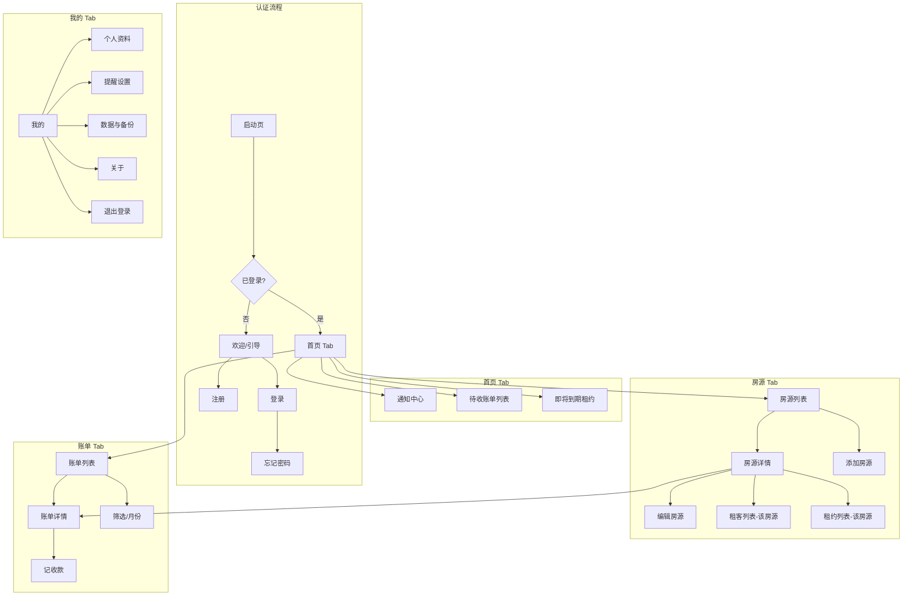
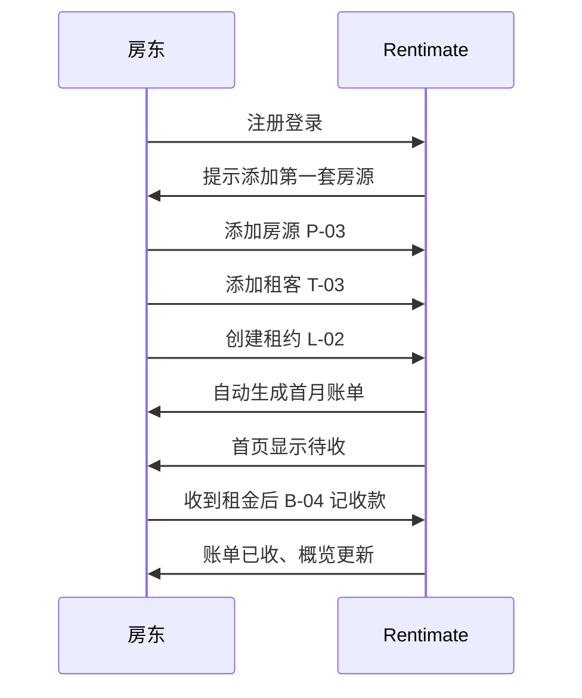

# Rentimate — 房东出租管理 App（iOS MVP 产品设计）

> **版本**：MVP v0.1 设计稿  
> **平台**：iOS 优先（后续扩展 Android）  
> **目标用户**：个人房东 / 小规模房东（自管 1～20 套房源）  
> **文档状态**：初稿，含待你确认的假设与开放问题

---

## 目录

1. [产品定位](#1-产品定位)
2. [MVP 范围](#2-mvp-范围)
3. [设计原则](#3-设计原则)
4. [信息架构与导航](#4-信息架构与导航)
5. [全局规范](#5-全局规范)
6. [页面清单总览](#6-页面清单总览)
7. [逐页设计](#7-逐页设计)
8. [核心用户流程](#8-核心用户流程)
9. [数据模型（MVP）](#9-数据模型mvp)
10. [技术建议（iOS）](#10-技术建议ios)
11. [待确认问题](#11-待确认问题)
12. [版本路线图](#12-版本路线图)

---

## 1. 产品定位

### 1.1 一句话

**Rentimate** 帮房东在一款 App 里管理房源、租客、租约与收租账单，减少 Excel / 微信记账的混乱。

### 1.2 解决的问题

| 痛点 | MVP 解法 |
|------|----------|
| 多套房、多个租客信息分散 | 房源 + 租客 + 租约结构化存储 |
| 每月谁该交租、是否逾期不清楚 | 首页待办 + 账单列表 + 逾期标记 |
| 租约到期忘记续签 | 租约到期提醒（本地通知） |
| 收款记录对不上 | 账单「记一笔收款」+ 流水记录 |

### 1.3 非目标（MVP 不做）

- 在线支付 / 代收租金
- 租客端 App 或小程序
- 电子合同签署、实名认证
- 智能门锁、IoT 对接
- 多房东协作、子账号权限
- 复杂财务报表、税务申报
- 招租发布到第三方平台

---

## 2. MVP 范围

### 2.1 必须有（P0）

- 账号注册 / 登录（邮箱或手机号，见 [§11](#11-待确认问题)）
- 房源 CRUD + 照片
- 租客 CRUD
- 租约创建（关联房源 + 租客 + 租金周期）
- 账单自动生成（按租约周期）+ 手动记收款
- 首页仪表盘（待收、逾期、即将到期租约）
- 推送 / 本地提醒（收租日、逾期、租约到期）
- 设置与个人资料

### 2.2 应该有（P1，时间允许再做）

- 维修报修记录（简版，仅房东自用备注）
- 支出记账（物业费、维修费等）
- 数据导出 CSV
- 搜索（房源 / 租客 / 账单）

### 2.3 明确不做（v1.0 之后）

- Android 版（设计时保持组件可复用思路即可）
- iPad 专属布局
- 英文界面（MVP 仅简体中文）

---

## 3. 设计原则

1. **3 次点击内完成高频操作**：记收款、看本月待收、加租客。
2. **先列表后详情**：所有实体列表支持左滑快捷操作（编辑 / 删除 / 记收款）。
3. **状态一眼可见**：账单用颜色区分「待收 / 部分收 / 已收 / 逾期」。
4. **离线可用**：核心数据本地缓存，有网时同步（MVP 可先纯本地 + iCloud 备份，见 §11）。
5. **符合 iOS HIG**：底部 Tab、大标题导航、Sheet 表单、系统相册与相机。

---

## 4. 信息架构与导航

### 4.1 主导航（Tab Bar，4 项）

```
┌─────────┬─────────┬─────────┬─────────┐
│  首页   │  房源   │  账单   │  我的   │
│  🏠     │  🏢     │  💰     │  👤     │
└─────────┴─────────┴─────────┴─────────┘
```

| Tab | 职责 |
|-----|------|
| 首页 | 待办、概览、快捷入口 |
| 房源 | 房源列表 → 详情 → 租客 / 租约入口 |
| 账单 | 按月收租账单、记收款 |
| 我的 | 设置、提醒、关于、账号 |

### 4.2 全局导航图



### 4.3 页面层级（栈导航）

- **一级**：各 Tab 根页面（大标题）
- **二级**：详情页
- **三级**：表单 / 编辑（建议用 **Sheet** 从底部弹出，保存后 dismiss）
- **模态**：记收款、筛选、图片选择、确认删除

---

## 5. 全局规范

### 5.1 视觉（建议）

| 元素 | 规范 |
|------|------|
| 主色 | `#2563EB`（蓝，信任、专业） |
| 成功/已收 | `#16A34A` |
| 警告/即将到期 | `#F59E0B` |
| 危险/逾期 | `#DC2626` |
| 背景 | 系统 `Grouped Background` |
| 字体 | SF Pro，标题 Large Title，正文 Body |
| 圆角卡片 | 12pt，内边距 16pt |
| 触控目标 | 最小 44×44 pt |

### 5.2 账单状态色

| 状态 | 标签 | 色 |
|------|------|-----|
| `pending` | 待收 | 灰蓝 |
| `partial` | 部分收 | 橙 |
| `paid` | 已收 | 绿 |
| `overdue` | 逾期 | 红 |

### 5.3 通用组件

- **空状态**：插画 + 主文案 + 主按钮（如「添加第一套房源」）
- **列表 Cell**：左图标/缩略图 + 标题 + 副标题 + 右侧金额或状态
- **浮动无**：MVP 用导航栏右侧「+」代替 FAB（更符合 iOS）
- **删除**：左滑删除 + 二次确认 Alert
- **表单**：Grouped List Style，`保存` 在导航栏右侧，无效时禁用

### 5.4 权限（Info.plist）

- 相机 / 相册：房源照片
- 通知：收租与到期提醒
- （可选）Face ID：应用锁 — P1

---

## 6. 页面清单总览

共 **32 个屏幕/状态**（含空态、错误态）。

| 编号 | 页面名称 | 类型 | Tab/入口 |
|------|----------|------|----------|
| A-01 | 启动页 Splash | 全屏 | 冷启动 |
| A-02 | 欢迎引导（3 屏） | 全屏滑动 | 首次安装 |
| A-03 | 登录 | 表单 | 未登录 |
| A-04 | 注册 | 表单 | A-03 |
| A-05 | 忘记密码 | 表单 | A-03 |
| H-01 | 首页仪表盘 | Tab 根 | 首页 |
| H-02 | 通知中心 | 列表 | H-01 |
| H-03 | 本月待收列表 | 列表 | H-01 |
| H-04 | 逾期账单列表 | 列表 | H-01 |
| H-05 | 即将到期租约 | 列表 | H-01 |
| P-01 | 房源列表 | Tab 根 | 房源 |
| P-02 | 房源列表-空态 | 状态 | P-01 |
| P-03 | 添加房源 | Sheet | P-01 |
| P-04 | 房源详情 | 详情 | P-01 |
| P-05 | 编辑房源 | Sheet | P-04 |
| T-01 | 租客列表（全局） | 列表 | P-04 / 快捷入口 |
| T-02 | 租客列表-空态 | 状态 | T-01 |
| T-03 | 添加租客 | Sheet | T-01 |
| T-04 | 租客详情 | 详情 | T-01 |
| T-05 | 编辑租客 | Sheet | T-04 |
| L-01 | 租约列表 | 列表 | P-04 |
| L-02 | 创建租约 | Sheet 多步 | L-01 / P-04 |
| L-03 | 租约详情 | 详情 | L-01 |
| L-04 | 编辑租约 / 退租 | Sheet | L-03 |
| B-01 | 账单列表（按月） | Tab 根 | 账单 |
| B-02 | 账单筛选 | Sheet | B-01 |
| B-03 | 账单详情 | 详情 | B-01 |
| B-04 | 记收款 | Sheet | B-03 / 左滑 |
| B-05 | 账单列表-空态 | 状态 | B-01 |
| M-01 | 我的 | Tab 根 | 我的 |
| M-02 | 个人资料 | 表单 | M-01 |
| M-03 | 提醒设置 | 表单 | M-01 |
| M-04 | 数据与备份 | 列表 | M-01 |
| M-05 | 关于 Rentimate | 静态 | M-01 |
| X-01 | 全局搜索 | 搜索 | 各列表导航栏 |
| X-02 | 通用错误页 | 状态 | 网络/未知错误 |
| X-03 | 删除确认 Alert | 模态 | 多处 |

---

## 7. 逐页设计

以下按模块列出。每个页面包含：**目的 · 布局线框 · 字段/交互 · 跳转 · 空/错态**。

---

### 7.1 认证模块

#### A-01 启动页 Splash

| 项 | 说明 |
|----|------|
| **目的** | 品牌展示，检查登录态 |
| **布局** | 全屏主色底；居中 Logo + 应用名「Rentimate」；底部无按钮 |
| **逻辑** | 显示 1～1.5s → 已登录进 H-01，未登录进 A-02（首次）或 A-03 |
| **资产** | App Icon、Logo SVG |

---

#### A-02 欢迎引导（3 屏，可跳过）

| 屏 | 标题 | 说明文案 | 插图主题 |
|----|------|----------|----------|
| 1 | 房源一目了然 | 多套出租房，一个 App 管理 | 楼房 |
| 2 | 收租不再忘 | 自动生成账单，到期提醒 | 日历+钱币 |
| 3 | 租约清清楚楚 | 租客、租金、押金有据可查 | 合同 |

- 底部：`跳过`（文字按钮）+ 分页指示器 + `开始使用`（最后一屏）
- 仅**首次安装**展示；设置里可「再看引导」— P1

---

#### A-03 登录

```
┌──────────────────────────────┐
│  ←                    注册 ›   │  导航栏
├──────────────────────────────┤
│  欢迎回来                     │
│  登录你的 Rentimate 账号       │
│                              │
│  [ 手机号 / 邮箱          ]   │
│  [ 密码              👁 ]   │
│                              │
│  忘记密码？                    │
│                              │
│  ┌────────────────────────┐  │
│  │       登 录            │  │  主按钮
│  └────────────────────────┘  │
│                              │
│  ─── 或 ───                   │
│  [  Apple 登录  ]  (P1)       │
└──────────────────────────────┘
```

| 字段 | 校验 |
|------|------|
| 账号 | 非空；手机 11 位或邮箱格式 |
| 密码 | 非空，≥6 位 |

- 错误：Toast / 行内红字「账号或密码错误」
- 成功 → H-01

---

#### A-04 注册

| 字段 | 必填 | 说明 |
|------|------|------|
| 昵称 | 是 | 显示在「我的」 |
| 手机号或邮箱 | 是 | 二选一或都支持，见 §11 |
| 验证码 | 是 | 60s 重发 |
| 密码 | 是 | ≥8 位，含字母+数字 |
| 确认密码 | 是 | 一致 |

- 底部：注册即表示同意《用户协议》《隐私政策》（可点击 WebView）
- 成功 → 自动登录 → H-01 或引导添加第一套房源（推荐弹窗）

---

#### A-05 忘记密码

- 输入手机号/邮箱 → 验证码 → 新密码 → 确认
- 成功 → A-03

---

### 7.2 首页模块

#### H-01 首页仪表盘

```
┌──────────────────────────────┐
│  首页              🔔 (3)    │
├──────────────────────────────┤
│  ┌─ 本月概览 ─────────────┐  │
│  │ 待收总额    ¥12,800    │  │
│  │ 已收        ¥8,000     │  │
│  │ 逾期笔数    2          │  │
│  └────────────────────────┘  │
│                              │
│  待办                         │
│  ┌ 逾期 · 阳光花园 3栋201    │  │
│  │     ¥3,200  逾期 5 天  › │  │
│  ├ 今日应收 · 城西公寓 A1   │  │
│  │     ¥2,800  待收      › │  │
│  └ 租约 7 天后到期 · ...    │  │
│                              │
│  快捷操作                     │
│  [ + 记收款 ] [ + 房源 ] [ + 租客 ] │
│                              │
│  我的房源 (3)           全部 › │
│  ┌────┐ ┌────┐ ┌────┐       │
│  │缩略│ │缩略│ │ +  │       │  横向滚动卡片
│  └────┘ └────┘ └────┘       │
└──────────────────────────────┘
```

| 区块 | 交互 |
|------|------|
| 通知图标 | → H-02 |
| 概览卡片 | 点击分项 → B-01 带筛选 |
| 待办 Cell | → B-03 或 L-03 |
| 快捷按钮 | 记收款 → 选账单；+房源 → P-03；+租客 → T-03 |
| 房源横滑 | → P-04 |

**下拉刷新**：重新计算待办与概览。

---

#### H-02 通知中心

- 列表：图标 + 标题 + 时间 + 未读蓝点
- 类型：收租提醒 / 逾期 / 租约到期 / 系统
- 左滑：标记已读；右上角「全部已读」
- 点击 → 跳转对应账单或租约详情

---

#### H-03 本月待收列表 · H-04 逾期列表 · H-05 即将到期租约

- 结构与 B-01 / L-01 的筛选子集相同，标题分别为「本月待收」「逾期账单」「即将到期租约」
- 支持按金额/日期排序

---

### 7.3 房源模块

#### P-01 房源列表

```
┌──────────────────────────────┐
│  房源                    +    │
│  🔍 搜索房源...               │
├──────────────────────────────┤
│  [ 全部 ▾ ]  [ 在租 | 空置 ]   │  分段控件
├──────────────────────────────┤
│  ┌────────────────────────┐  │
│  │ [图] 阳光花园 3栋201      │  │
│  │      2室1厅 · 在租       │  │
│  │      当前租客：张三       │  │
│  │      月租 ¥3,200        │  │
│  └────────────────────────┘  │
│  ...                         │
└──────────────────────────────┘
```

| 左滑 | 操作 |
|------|------|
| 右滑 | 编辑 → P-05 |
| 左滑 | 删除（无活跃租约才可删，否则提示先退租） |

- 导航栏 `+` → P-03
- 搜索 → X-01

---

#### P-02 房源列表 - 空态

- 插画 +「还没有房源」+ 按钮「添加第一套房源」→ P-03

---

#### P-03 添加房源 · P-05 编辑房源（同一表单）

| 字段 | 类型 | 必填 |
|------|------|------|
| 房源名称 | 文本 | 是 | 如「阳光花园 3栋201」 |
| 地址 | 文本 | 否 | 支持地图选点 P1 |
| 户型 | 选择 | 否 | 一室 / 两室… / 自定义 |
| 面积 | 数字 | 否 | ㎡ |
| 月参考租金 | 金额 | 否 | 仅展示用 |
| 房源状态 | 分段 | 是 | 在租 / 空置 |
| 备注 | 多行 | 否 |
| 照片 | 相册多选 | 否 | 最多 9 张，第一张为封面 |

- 导航：取消 | **保存**
- 保存成功 → P-04（新建）或返回 P-04（编辑）

---

#### P-04 房源详情

```
┌──────────────────────────────┐
│  ←  房源详情            编辑   │
├──────────────────────────────┤
│  [ 照片轮播 · Page Control ] │
│  阳光花园 3栋201              │
│  在租 · 2室1厅 · 68㎡         │
│  地址：xxx（可复制）           │
├──────────────────────────────┤
│  当前租约              查看 ›  │  → L-03
│  张三 · ¥3,200/月 · 至 2026-08 │
├──────────────────────────────┤
│  相关账单 (本月)        全部 ›  │  → B-01 筛选该房源
│  · 3月租金  待收  ¥3,200      │
├──────────────────────────────┤
│  历史租客                       │
│  维修记录 (P1)                  │
└──────────────────────────────┘
```

- 底部固定按钮（有活跃租约时）：**记收款** → B-04 预选该租约账单
- 无租约：显示「创建租约」→ L-02

---

### 7.4 租客模块

#### T-01 租客列表（全局）

- 入口：P-04「历史租客」、我的页面快捷入口（P1）、或首页
- Cell：头像（姓名首字）+ 姓名 + 手机 + 在租房源数
- `+` → T-03

#### T-02 空态

- 「还没有租客」→ T-03

#### T-03 添加租客 · T-05 编辑租客

| 字段 | 必填 |
|------|------|
| 姓名 | 是 |
| 手机号 | 是 |
| 微信号 | 否 |
| 身份证号 | 否 | MVP 本地存储，需隐私说明 |
| 紧急联系人 | 否 |
| 备注 | 否 |

#### T-04 租客详情

- 基本信息卡片
- **租约记录**列表 → L-03
- **账单记录**列表 → B-03
- 右上角：编辑、拨打电话（`tel:`）

---

### 7.5 租约模块

#### L-01 租约列表

- 筛选：进行中 / 已结束
- Cell：房源名 + 租客 + 租期 + 月租
- `+` → L-02

#### L-02 创建租约（建议 3 步 Sheet）

**步骤 1 — 选择房源**

- 列表单选；仅显示「空置」或允许「在租」换约（需确认）

**步骤 2 — 选择或新建租客**

- 搜索已有租客 | 新建租客（内嵌简化表单）

**步骤 3 — 租约条款**

| 字段 | 说明 |
|------|------|
| 起租日 | 日期选择器 |
| 到期日 | 日期；可勾选「无固定期限」 |
| 月租金 | 金额 |
| 押金 | 金额 |
| 付租方式 | 月付 / 季付 / 年付 / 自定义 |
| 每月应付日 | 1-28 日 |
| 是否自动生成账单 | 开关，默认开 |
| 备注 | 可选 |

- 完成 → 生成首月账单（若在开租期内）→ L-03

#### L-03 租约详情

- 状态徽章：进行中 / 已到期 / 已退租
- 条款摘要、押金、关联房源与租客
- 操作：**编辑** · **退租**（L-04）· **续租**（复制条款新建，P1）

#### L-04 退租 / 编辑租约

- **退租**：退租日、押金退还金额、结算备注 → 租约状态 `ended`，房源变空置，未结账单标为待处理
- **编辑**：未出账单周期可改租金；已出账单不改历史

---

### 7.6 账单模块

#### B-01 账单列表

```
┌──────────────────────────────┐
│  账单                    ≡    │  筛选
├──────────────────────────────┤
│  ◀  2026年3月  ▶              │  月份切换
├──────────────────────────────┤
│  汇总：待收 ¥5,600 · 已收 ¥8,000 │
├──────────────────────────────┤
│  3月租金 · 阳光花园           │
│  张三 · 应付 3/5    [ 逾期 ]   │
│  ¥3,200                      │
├──────────────────────────────┤
│  3月租金 · 城西公寓            │
│  李四 · 应付 3/10   [ 待收 ]   │
│  ¥2,400                      │
└──────────────────────────────┘
```

| 左滑 | 操作 |
|------|------|
| 快捷 | 记收款 → B-04 |
| 更多 | 编辑金额（仅待收）、删除（需确认） |

- 筛选 B-02：状态 / 房源 / 租客

#### B-02 账单筛选 Sheet

- 多选：待收、部分收、已收、逾期
- 可选房源、租客
- 重置 | 应用

#### B-03 账单详情

| 区块 | 内容 |
|------|------|
| 头部 | 金额大字 + 状态标签 |
| 关联 | 房源、租客、租约（可点） |
| 账期 | 2026-03-01 ~ 2026-03-31 |
| 应付日 | 2026-03-05 |
| 收款记录 | 时间线列表 |
| 备注 | 文本 |

- 底部主按钮：**记收款**（已收满则灰显「已结清」）
- 右上角：··· 菜单 → 编辑、删除

#### B-04 记收款 Sheet

| 字段 | 说明 |
|------|------|
| 应收金额 | 只读 |
| 本次收款 | 数字，默认填满剩余 |
| 收款日期 | 默认今天 |
| 收款方式 | 微信 / 支付宝 / 银行转账 / 现金 / 其他 |
| 备注 | 可选 |

- 部分收款：账单状态 → `partial`；全额 → `paid`
- 保存后 Toast「收款已记录」，刷新 B-03 / H-01

#### B-05 账单空态

- 「暂无账单」说明需先创建租约并开启自动生成

---

### 7.7 我的模块

#### M-01 我的

```
┌──────────────────────────────┐
│  [头像]  昵称                 │
│         138****8000          │
├──────────────────────────────┤
│  个人资料                  › │
│  提醒设置                  › │
│  数据与备份                › │
│  帮助与反馈 (P1)           › │
│  关于 Rentimate            › │
├──────────────────────────────┤
│  退出登录                     │
└──────────────────────────────┘
```

- 顶部统计条（可选）：房源数 / 在租租约数 / 本月已收

#### M-02 个人资料

- 头像（相册）、昵称、手机、邮箱、修改密码

#### M-03 提醒设置

| 开关 | 提前时间 |
|------|----------|
| 收租日提醒 | 当天 / 提前 1 天 / 3 天 |
| 逾期提醒 | 逾期后每天 / 仅一次 |
| 租约到期提醒 | 提前 7 / 14 / 30 天 |

- 依赖 iOS 通知权限；未授权时显示「去系统设置开启」

#### M-04 数据与备份

- 显示：本地 X 条房源、X 条账单
- **导出 CSV**（P1）
- **iCloud 同步**开关（P1，见 §11）
- 清除缓存（不影响业务数据）

#### M-05 关于

- 版本号、用户协议、隐私政策、开源许可

---

### 7.8 通用页面

#### X-01 全局搜索

- iOS 标准 `.searchable`
- 结果分组：房源 / 租客 / 账单
- 点击进对应详情

#### X-02 通用错误

- 图标 + 说明 +「重试」按钮

#### X-03 删除确认 Alert

- 标题：「删除房源？」
- 文案：说明不可恢复及约束
- 取消 | 删除（ destructive ）

---

## 8. 核心用户流程

### 8.1 新用户首日（Happy Path）



### 8.2 每月收租（重复流程）

1. 收到推送「今日应收」
2. 打开 H-01 或 B-01
3. 进入 B-03 → B-04 记收款
4. 状态变已收

### 8.3 租客退租

1. L-03 → 退租 L-04
2. 结算押金与末月账单
3. 房源 P-04 状态 → 空置
4. 可选新建租约给下一位租客

---

## 9. 数据模型（MVP）

```
User
  id, name, phone, email, avatarUrl, createdAt

Property（房源）
  id, userId, name, address, layout, area, status(rented|vacant),
  referenceRent, note, photoUrls[], createdAt, updatedAt

Tenant（租客）
  id, userId, name, phone, wechat, idNumber?, emergencyContact?, note

Lease（租约）
  id, propertyId, tenantId, startDate, endDate?, monthlyRent, deposit,
  payCycle(monthly|quarterly|...), dueDay(1-28), status(active|ended),
  autoGenerateBills, note

Bill（账单）
  id, leaseId, propertyId, tenantId, periodStart, periodEnd,
  dueDate, amountDue, amountPaid, status(pending|partial|paid|overdue),
  type(rent|deposit|other)

Payment（收款记录）
  id, billId, amount, paidAt, method, note

Notification
  id, userId, type, title, body, read, relatedId, createdAt
```

**账单自动生成规则（建议）**：

- 租约生效且 `autoGenerateBills=true` 时，按 `payCycle` 在每个周期开始日创建账单
- `dueDate` = 该周期对应月份的 `dueDay`
- 每日凌晨任务（或打开 App 时）：`dueDate < today` 且未结清 → 标记 `overdue`

---

## 10. 技术建议（iOS）

| 项 | 建议 |
|----|------|
| 最低系统 | iOS 17+ |
| UI 框架 | SwiftUI |
| 本地库 | SwiftData 或 Core Data |
| 架构 | MVVM + Repository |
| 认证 | Supabase / Firebase Auth（待定） |
| 同步 | MVP 本地优先；P1 CloudKit 或自建 API |
| 图标 | SF Symbols + 自定义 App Icon |

---

## 11. 待确认问题

请回复以下问题，我会据此更新本文档（v0.2）：

1. **账号方式**：仅手机号？仅邮箱？还是两者都要？是否需要 **Sign in with Apple**（上架 App Store 常要求）？
2. **房源类型**：只有「整租一套」？还是有一栋楼多个「房间/单元」需要管理？
3. **账单**：除租金外， MVP 要不要支持「水电燃气等杂费」单独账单？
4. **货币**：仅人民币？是否需要多币种？
5. **数据存储**：纯本地即可，还是必须登录云端多设备同步？
6. **维修报修**：MVP 要不要简单记录（日期、描述、费用）？
7. **隐私**：身份证号等敏感字段是否 MVP 就要？还是删掉改备注？
8. **应用名称**：对外品牌确定叫 **Rentimate** 还是中文名（如「租易管」）？
9. **目标市场**：仅中国大陆房东？界面是否将来要做繁体/英文？
10. **竞品参考**：有没有你觉得好用或难用的 App（如贝壳、自如房东版、各类记账 App）？

---

## 12. 版本路线图

| 版本 | 内容 |
|------|------|
| **MVP v1.0** | 本文 P0：认证、房源、租客、租约、账单、首页、提醒 |
| **v1.1** | 维修记录、支出记账、CSV 导出、搜索增强 |
| **v1.2** | iCloud 同步 / 账号多端 |
| **v2.0** | Android、租客端（查看账单/报修）、在线支付对接 |

---

## 附录 A：屏幕跳转矩阵（简表）

| 从 \ 到 | P-04 | T-04 | L-03 | B-03 | B-04 |
|---------|------|------|------|------|------|
| H-01 | ✓ | | ✓ | ✓ | ✓ |
| P-01 | ✓ | | | | |
| T-01 | | ✓ | | | |
| L-01 | ✓ | ✓ | ✓ | | |
| B-01 | ✓ | ✓ | ✓ | ✓ | ✓ |

---

## 附录 B：P1 页面预留（不在 MVP 开发，可先做线框）

| 编号 | 页面 |
|------|------|
| R-01 | 维修列表 |
| R-02 | 添加维修记录 |
| E-01 | 支出列表 |
| E-02 | 添加支出 |
| S-01 | 统计报表（月收入趋势） |

---

*文档维护：请在确认 §11 答案后迭代版本号。设计稿 Figma 链接可补充在本节下方。*

**Figma / 高保真**：_（待补充）_  
**最后更新**：2026-05-27
